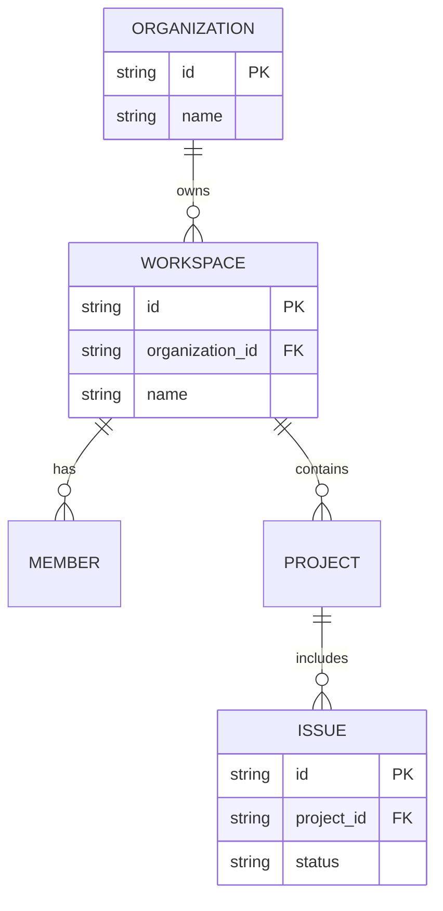
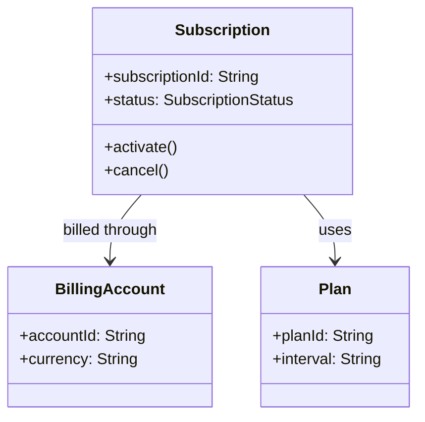

# Data Modeling

## 개요
제품 기획에서 데이터 모델링은 DB 스키마 설계의 하위 작업이 아니다. 도메인 개념이 무엇인지, 어떤 경계 안에서 어떤 규칙이 작동하는지, 그리고 어떤 이벤트가 시스템 동작을 바꾸는지를 명확히 하는 일이다. 이 작업이 약하면 PRD는 화면 설명서가 되고, 구현은 우발적 상태 필드의 집합이 된다.

DDD(Domain-Driven Design)는 복잡한 비즈니스 규칙을 모델의 언어로 끌어올리는 접근이고, Event Storming은 그것을 협업적으로 발견하는 워크숍 형식이다. ERD와 Data Dictionary는 이후 구조를 더 명시적으로 고정하는 artifact다. Mermaid는 이들을 텍스트 기반 문서 안에서 유지하기 쉽게 만든다.

## 원칙/방법론별 섹션

### DDD 핵심 개념: Bounded Context / Aggregate / Entity / Value Object / Domain Event
**요약**: Eric Evans의 DDD는 모델을 코드와 문서 모두의 중심에 둔다. Bounded Context는 특정 모델과 언어가 일관되게 통하는 경계이고, Aggregate는 변경 일관성의 단위이며, Entity는 식별성이 중요한 객체, Value Object는 속성값 자체가 의미의 전부인 객체다. Domain Event는 도메인에서 의미 있는 사건을 명시적으로 드러낸다.

기획 문서에 이 개념이 필요한 이유는 기능을 화면 기준으로만 쪼개지 않기 위해서다. 예를 들어 "구독", "청구", "권한"을 한 모델로 섞으면 용어 충돌이 생기고, 나중에 조직/시스템 경계도 꼬인다. 반대로 bounded context를 의식하면 PRD의 용어도 더 안정된다.

**핵심 질문/포맷/체크리스트**:
- 어떤 용어가 어떤 컨텍스트에서만 참인가?
- 어떤 데이터는 식별성보다 값 동등성이 중요한가?
- 어떤 변경은 같은 aggregate 안에서만 강한 일관성이 필요한가?
- 어떤 사건을 domain event로 명시하면 흐름이 더 또렷해지는가?

**적용 시점**: 복잡한 도메인 정의, 마이크로서비스 경계 논의, 핵심 비즈니스 규칙 모델링.
**한계/주의사항**: DDD 용어만 붙이고 CRUD 설계를 유지하면 효과가 없다. 모든 곳에 aggregate를 크게 잡으면 오히려 병목이 생긴다.
**출처**:
- https://www.domainlanguage.com/ddd/reference/ [dated: 2025-10]
- https://www.domainlanguage.com/ddd/blue-book/ [dated: 2025-10]
- https://elearn.domainlanguage.com/modules/bcintro/ [dated: 2013-12]

### Event Storming (Alberto Brandolini)
**요약**: Event Storming은 복잡한 비즈니스 프로세스를 도메인 이벤트 중심으로 빠르게 모델링하는 협업 기법이다. Alberto Brandolini는 이를 deliberate collective learning으로 설명한다. 즉 완성도 높은 다이어그램을 만드는 것보다, 도메인을 함께 이해하는 과정이 더 중요하다.

Big Picture Event Storming은 프로세스와 병목을 발견하는 데, Process Design/Software Design 쪽은 command, policy, aggregate, read model 등을 더 세밀히 다루는 데 적합하다. 제품 기획 단계에서 특히 좋은 점은 business와 tech가 같은 벽 앞에서 같은 언어를 쓰게 만든다는 점이다.

**핵심 질문/포맷/체크리스트**:
- 도메인에서 실제로 발생하는 사건을 과거형 event로 적었는가?
- hotspot/unknown area가 드러나는가?
- command, policy, actor를 구분해 볼 필요가 있는가?
- 병목/대기/핸드오프가 어디서 발생하는가?

**적용 시점**: 도메인 탐색, 프로세스 재설계, bounded context 후보 탐색.
**한계/주의사항**: 벽에 스티커를 붙이는 행위가 목적이 되면 실패한다. 퍼실리테이션이 약하면 noisy brainstorm으로 끝난다.
**출처**:
- https://www.eventstorming.com/
- https://www.eventstorming.com/book/
- https://www.eventstorming.com/resources/

### ERD Crow's Foot
**요약**: ERD(Entity Relationship Diagram)는 엔터티와 관계를 구조적으로 명시한다. Crow's Foot 표기는 one-to-many, optionality를 시각적으로 분명히 보여줘 데이터 모델 커뮤니케이션에 널리 쓰인다.

제품 기획 관점에서는 ERD가 화면 정의보다 상위 구조를 보여준다. 특히 관리자 제품, B2B SaaS, 업무 도메인처럼 관계가 복잡한 경우 필수다. 엔터티 이름은 가급적 단수형으로 두고, 관계의 의미를 동사로 읽히게 하는 편이 좋다.

**핵심 질문/포맷/체크리스트**:
- 엔터티가 진짜 도메인 개념을 반영하는가?
- 관계의 cardinality/optionality가 명시되는가?
- 속성이 아닌 별도 엔터티여야 할 개념을 잘 분리했는가?
- 한 관계를 실제 문장으로 읽었을 때 자연스러운가?

**적용 시점**: 구조 설계, 데이터 저장 모델 합의, analytics/event schema 전 단계.
**한계/주의사항**: ERD는 행위 규칙과 시간 흐름을 잘 설명하지 못한다. DDD/이벤트 모델과 함께 봐야 한다.
**출처**:
- https://mermaid.js.org/syntax/entityRelationshipDiagram.html

### Mermaid erDiagram 공식 패턴
**요약**: Mermaid `erDiagram`은 Markdown 안에서 가벼운 ERD를 유지하기에 적합하다. 공식 문법은 PlantUML 호환 관계 표기와 attribute block을 지원한다.

**핵심 질문/포맷/체크리스트**:
- 관계 라벨이 first entity 관점에서 읽히는가?
- cardinality가 정확한가?
- attribute에 PK/FK 의미를 드러냈는가?

**적용 시점**: 설계 초안, PRD/ADR 삽입, lightweight schema comms.
**한계/주의사항**: 복잡한 물리 스키마 전체를 표현하기엔 한계가 있다.
**출처**:
- https://mermaid.js.org/syntax/entityRelationshipDiagram.html

### Mermaid classDiagram 공식 패턴
**요약**: Mermaid `classDiagram`은 개념 모델, aggregate 내부 구조, 도메인 오브젝트 관계를 표현하는 데 적합하다. 속성과 메서드를 함께 적을 수 있어 단순 ERD보다 행위적 모델을 더 잘 담는다.

**핵심 질문/포맷/체크리스트**:
- 클래스명이 도메인 언어와 일치하는가?
- 속성과 행위를 함께 보아야 하는 개념인가?
- 연관/구성/상속을 구분했는가?

**적용 시점**: 도메인 모델 초안, aggregate 설명, 객체 협력 설명.
**한계/주의사항**: 구현 클래스 다이어그램으로 곧장 내려가면 추상 수준이 너무 빨리 무너질 수 있다.
**출처**:
- https://mermaid.js.org/syntax/classDiagram.html

### Data Dictionary 포맷
**요약**: Data Dictionary는 필드 이름 목록이 아니라 데이터 계약(data contract)이다. 최소한 이름, 설명, 타입, 허용값, null 가능 여부, 생성 주체, 시스템 오브 레코드, 변경 규칙을 담아야 한다.

기획 단계에서 Data Dictionary를 만들면 analytics/event naming drift를 줄이고, API/DB/UI가 서로 다른 이름을 쓰는 문제를 조기에 막을 수 있다.

**핵심 질문/포맷/체크리스트**:
- Field name / business meaning / data type
- Required? Nullable? Default?
- Allowed values / enum definition
- Source of truth / owner
- Created at / updated at semantics
- PII 여부와 retention rule

**적용 시점**: API 설계, 이벤트 스키마, analytics tracking plan, admin/reporting 제품.
**한계/주의사항**: 운영 ownership 없이는 금방 썩는다. glossary와 schema registry가 분리되면 중복 관리가 생긴다.
**출처**:
- https://www.domainlanguage.com/ddd/reference/ [dated: 2025-10]
- https://mermaid.js.org/syntax/entityRelationshipDiagram.html

## 참고 링크 (전체)
- https://www.domainlanguage.com/ddd/reference/ [dated: 2025-10]
- https://www.domainlanguage.com/ddd/blue-book/ [dated: 2025-10]
- https://elearn.domainlanguage.com/modules/bcintro/ [dated: 2013-12]
- https://www.eventstorming.com/
- https://www.eventstorming.com/book/
- https://www.eventstorming.com/resources/
- https://mermaid.js.org/syntax/entityRelationshipDiagram.html
- https://mermaid.js.org/syntax/classDiagram.html
