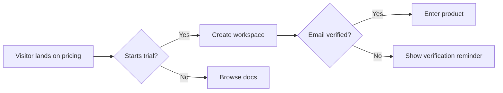
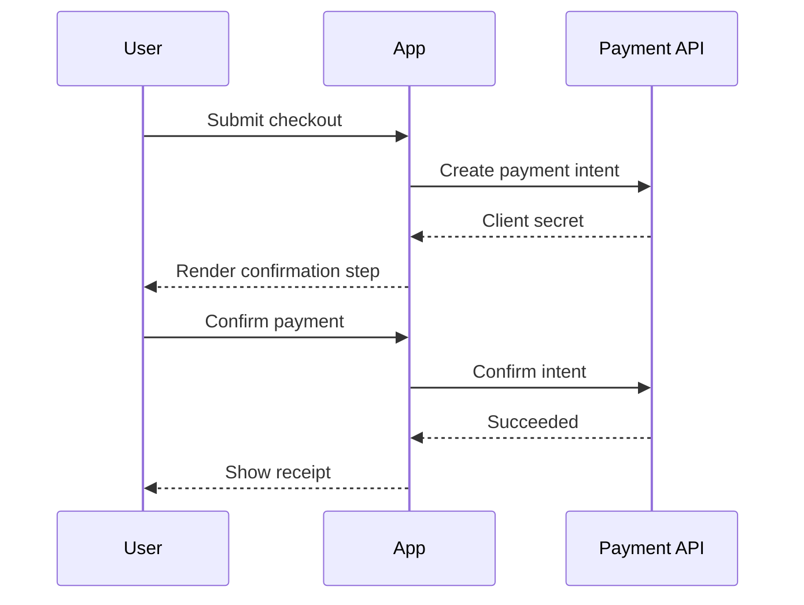
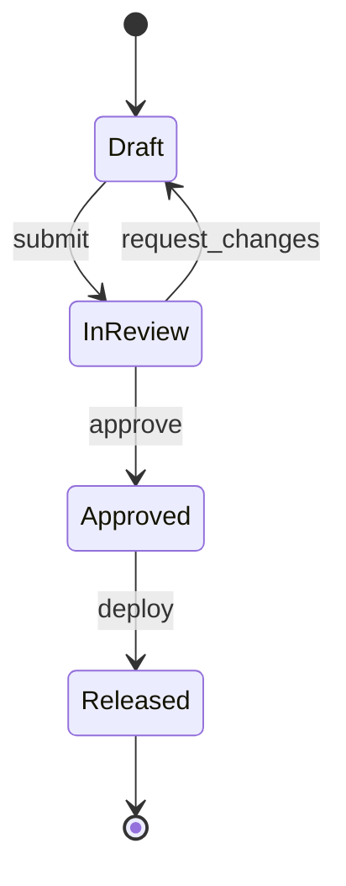
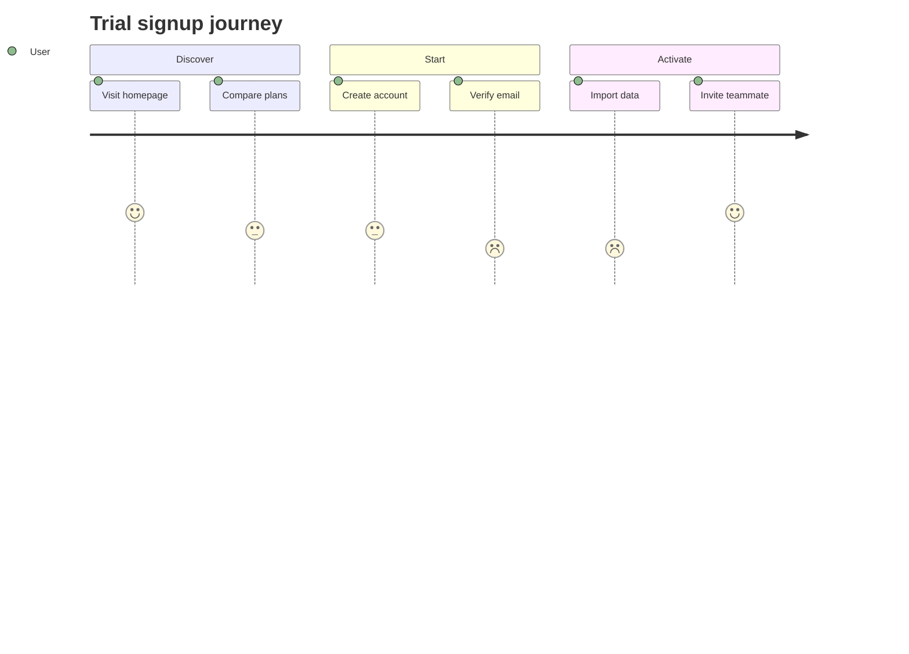

# Flows

## 개요
제품 기획에서 flow artifact는 "어떤 화면이 어디로 이동하는가"만 설명하는 도표가 아니다. User Flow, Journey Map, Service Blueprint, IA(Information Architecture)는 각기 다른 해상도로 경험과 구조를 표현한다. 이 차이를 구분하지 않으면 문서가 맞는 질문에 답하지 못한다.

User Flow는 사용자가 목표를 달성하기 위해 밟는 분기/단계에 집중하고, Journey Map은 감정과 맥락을 포함한 경험 전체를 다루며, Service Blueprint는 frontstage와 backstage 운영 체계를 함께 그린다. IA는 정보와 내비게이션 구조를 설계한다. Mermaid는 이들을 lightweight하게 문서화할 때 유용한 공식 문법을 제공한다.

## 원칙/방법론별 섹션

### User Flow vs Journey Map vs Service Blueprint
**요약**: User Flow는 task completion 경로를, Journey Map은 시간 순 경험과 감정 곡선을, Service Blueprint는 사용자 접점 뒤의 내부 운영/시스템 계층까지 포함한다. 즉 셋은 대체 관계가 아니라 질문이 다른 도구다.

실무적으로는 "checkout drop-off를 줄이고 싶다"면 user flow가 먼저고, "고객 경험 전체 어디서 신뢰가 깨지는가"를 보려면 journey map, "왜 지원 문의가 반복되는가"를 풀려면 blueprint가 맞다.

**핵심 질문/포맷/체크리스트**:
- User Flow: 목표, 단계, 분기, 예외 흐름이 있는가?
- Journey Map: 단계별 행동, 감정, pain point, 채널이 있는가?
- Service Blueprint: frontstage/backstage/support process/시스템이 연결되는가?
- 현재 문서가 어떤 질문에 답하려는지 명시했는가?

**적용 시점**: 기능 흐름 설계(user flow), 경험 진단(journey), 운영 개선(service blueprint).
**한계/주의사항**: 하나의 도표에 셋을 다 넣으려 하면 가독성이 무너진다. 의사결정 목적에 맞는 artifact를 따로 만드는 편이 낫다.
**출처**:
- https://www.nngroup.com/articles/journey-mapping-101/ [dated: 2025-10]
- https://www.nngroup.com/articles/service-blueprints-definition/ [dated: 2025-10]

### IA (Information Architecture)
**요약**: IA는 콘텐츠와 기능을 사람이 이해하고 찾기 쉬운 구조로 조직하는 작업이다. Rosenfeld/Morville 전통에서는 organization, labeling, navigation, search 시스템이 핵심 축으로 다뤄진다.

제품 기획 관점에서 IA는 화면 목록 작성보다 상위 개념이다. 무엇을 top-level로 노출할지, 어떤 용어로 묶을지, 사용자가 어디서 길을 잃는지를 다루기 때문이다. 특히 복잡한 B2B SaaS와 설정 화면, 문서형 제품에서 중요하다.

**핵심 질문/포맷/체크리스트**:
- 정보 단위가 사용자 mental model에 맞게 묶였는가?
- 라벨이 내부 조직 용어가 아니라 사용자 언어인가?
- navigation depth와 breadth가 과도하지 않은가?
- 검색이 필요한 영역과 browse가 적합한 영역을 구분했는가?

**적용 시점**: 내비게이션 재설계, 복잡한 정보 구조 정리, 문서/설정/관리자 제품.
**한계/주의사항**: IA를 사이트맵만으로 축소하면 실제 탐색 경험을 놓친다. 사용자 리서치 없이 taxonomy를 만들면 내부 조직도 반영 문서가 되기 쉽다.
**출처**:
- https://www.oreilly.com/library/view/information-architecture-4th/9781491913529/ [dated: 2025-10]

### Mermaid Flowchart 공식 패턴
**요약**: Mermaid flowchart는 빠른 decision flow, onboarding path, approval branch를 Markdown 안에 직접 넣을 때 유용하다. 공식 문서 기준으로 `flowchart LR` 또는 `graph LR`를 선언하고 노드/엣지를 텍스트로 정의한다.

아래 예시는 공식 문법 10.x+ / 11.x 계열에서 유효한 형태다.

**핵심 질문/포맷/체크리스트**:
- 방향(`LR`, `TD`)이 목적에 맞는가?
- 분기 조건이 edge label로 표현되는가?
- 소문자 `end` 같은 breaker를 피했는가?

**적용 시점**: 기능 흐름, 승인 분기, funnel 시각화.
**한계/주의사항**: 복잡한 experience map 전체를 flowchart 하나에 몰아넣지 말 것.
**출처**:
- https://mermaid.js.org/syntax/flowchart.html

### Mermaid Sequence Diagram 공식 패턴
**요약**: sequenceDiagram은 actor/system 간 메시지 순서를 표현한다. API handshake, approval workflow, payment callback 같은 상호작용 중심 흐름에 적합하다.

**핵심 질문/포맷/체크리스트**:
- participant를 역할 단위로 정의했는가?
- 요청/응답 순서가 시간축대로 보이는가?
- 조건 분기는 `alt`/`else`를 쓰는가?

**적용 시점**: 시스템 상호작용, external integration, async callback 설명.
**한계/주의사항**: 화면 흐름을 sequence로 그리면 읽기 어려워질 수 있다.
**출처**:
- https://mermaid.js.org/syntax/sequenceDiagram.html

### Mermaid State Diagram 공식 패턴
**요약**: stateDiagram은 엔터티나 프로세스의 상태 전이를 표현한다. 주문, 티켓, 리퀘스트 lifecycle에 특히 적합하다.

**핵심 질문/포맷/체크리스트**:
- 상태가 상호배타적인가?
- 전이 이벤트가 명확한가?
- terminal state가 있는가?

**적용 시점**: issue lifecycle, order status, review workflow.
**한계/주의사항**: 화면 이동과 상태 전이를 혼동하지 말 것.
**출처**:
- https://mermaid.js.org/syntax/stateDiagram

### Mermaid User Journey 공식 패턴
**요약**: Mermaid는 `journey` 문법으로 간단한 user journey를 표현한다. 단계별 만족도 점수와 actor를 함께 적을 수 있어 lightweight journey map에 적합하다.

**핵심 질문/포맷/체크리스트**:
- 섹션이 사용자 목표 단계와 맞는가?
- task score가 1~5 범위로 일관적인가?
- actor가 명시돼 있는가?

**적용 시점**: 간단한 as-is 여정 정리, pain point 공유.
**한계/주의사항**: 상세한 service blueprint를 대체하진 못한다.
**출처**:
- https://mermaid.js.org/syntax/userJourney

## 참고 링크 (전체)
- https://www.nngroup.com/articles/journey-mapping-101/ [dated: 2025-10]
- https://www.nngroup.com/articles/service-blueprints-definition/ [dated: 2025-10]
- https://www.oreilly.com/library/view/information-architecture-4th/9781491913529/ [dated: 2025-10]
- https://mermaid.js.org/syntax/flowchart.html
- https://mermaid.js.org/syntax/sequenceDiagram.html
- https://mermaid.js.org/syntax/stateDiagram
- https://mermaid.js.org/syntax/userJourney
