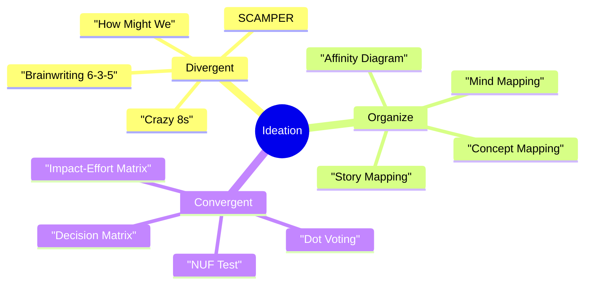
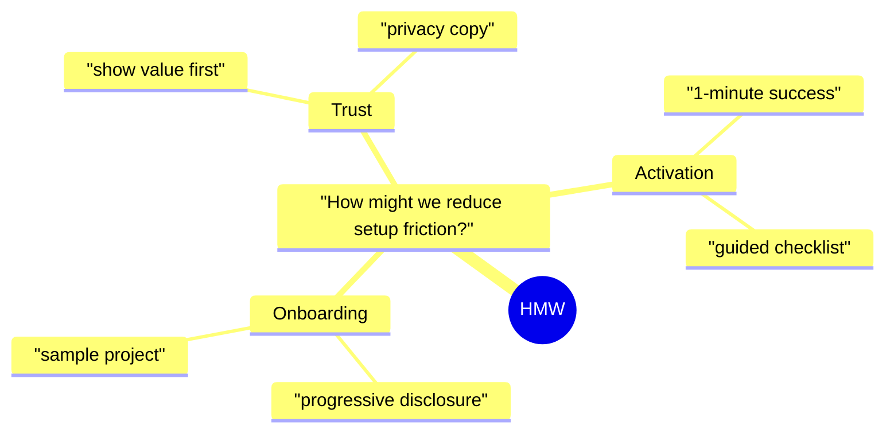
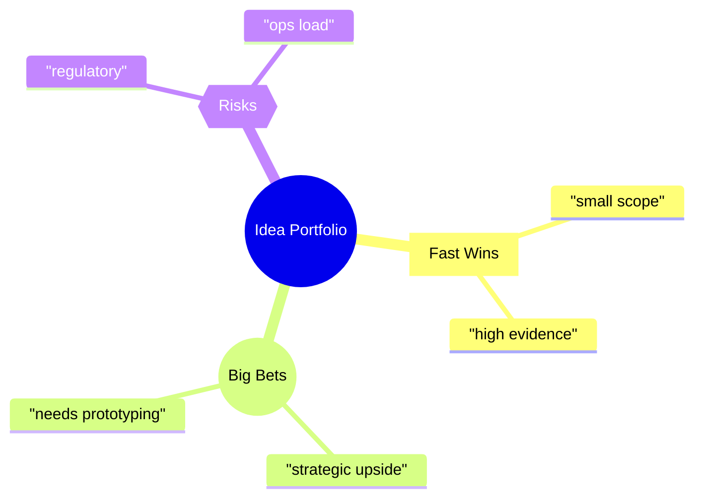

# Ideation

## 개요
제품 기획의 `ideation`은 discovery 이전에 놓이는 0단계다. 이 단계의 목적은 "좋은 아이디어 하나를 찍는 것"이 아니라, 막연한 생각, 관찰 조각, 불편함, 욕망, 기술 가능성, 사업 제약을 한 번 넓게 펼친 뒤 구조화된 후보군으로 바꾸는 것이다. discovery가 "어떤 문제를 누구를 위해 왜 풀 것인가"를 검증 가능한 문제 정의로 다룬다면, ideation은 그 직전에 팀의 암묵지와 초기 직관을 발산(divergent)하고, 유사 항목을 묶고 언어를 정리(organize)하며, 실제로 다뤄볼 가치가 있는 방향으로 수렴(convergent)시키는 단계다.

강한 ideation은 자유로운 브레인스토밍만으로 성립하지 않는다. Guilford의 발산-수렴 사고(divergent-convergent thinking), Design Council의 Double Diamond, IDEO의 desirability-feasibility-viability 같은 프레임은 공통적으로 "넓히는 시간"과 "좁히는 시간"을 의도적으로 분리하라고 요구한다. 발산 단계에서는 아이디어 수, 관점 전환, 조합 가능성이 중요하고, 정리 단계에서는 묶음·관계·언어가 중요하며, 수렴 단계에서는 선택 기준과 트레이드오프가 중요하다.

실무적으로는 이 리듬이 중요하다. 너무 빨리 수렴하면 기존 해답의 변주만 남고, 너무 오래 발산하면 아이디어 무덤이 된다. 그래서 ideation은 `발산 → 정리 → 수렴`의 왕복 리듬으로 설계해야 한다. 아래 방법론들은 이 리듬을 강제하거나 보조하는 도구들이다.

## 방법론별 섹션

### Divergent ↔ Convergent Thinking / Double Diamond
**요약**: ideation 전체를 관통하는 상위 프레임이다. Guilford는 창의성을 단일 정답 탐색이 아니라 다수 가능성을 생성하는 발산 사고와, 그중 적절한 방향을 고르는 수렴 사고의 상호작용으로 보았다. Design Council의 Double Diamond는 이를 실무 프로세스로 번역해, 한 번 넓히고 한 번 좁히는 리듬이 discovery와 development 양쪽에 반복된다고 설명한다.

**핵심 질문·포맷·체크리스트**:
- 지금 회의는 발산 시간인가, 수렴 시간인가?
- 발산 중인데 평가와 반박이 섞여 있지 않은가?
- 수렴 중인데 기준 없이 인기투표만 하고 있지 않은가?
- 첫 다이아몬드와 둘째 다이아몬드를 혼동해 문제 탐색과 해법 탐색을 섞지 않았는가?
- "넓히기"와 "좁히기"의 종료 조건을 미리 정했는가?

**적용 시점**: ideation 워크숍 설계 전, 세션 퍼실리테이션 룰 설정 시, 팀이 "지금 뭘 해야 하는지" 헷갈릴 때.
**한계·주의**: Double Diamond는 과정 지도이지 상세 기법이 아니다. 발산과 수렴의 이름만 붙이고 실제로는 의견 강자가 방향을 고정해버리면 아무 효과가 없다.
**출처**:
- https://www.designcouncil.org.uk/our-work/skills-learning/tools-frameworks/framework-for-innovation-design-councils-evolved-double-diamond/
- https://www.designcouncil.org.uk/our-resources/the-double-diamond/ [dated: 2024-11]
- https://www.designcouncil.org.uk/our-resources/the-double-diamond/history-of-the-double-diamond/ [dated: 2025-04]

### IDEO 3 Lenses (Desirability, Feasibility, Viability)
**요약**: IDEO의 세 렌즈는 아이디어의 질을 "사람이 원하는가(desirability), 기술·운영적으로 가능한가(feasibility), 비즈니스로 성립하는가(viability)"의 교차점으로 본다. ideation에서는 발산된 후보를 죽이는 체크리스트가 아니라, 아이디어를 세 방향에서 보강하는 렌즈로 쓰는 것이 좋다.

**핵심 질문·포맷·체크리스트**:
- 이 아이디어는 누가 실제로 원할까?
- 기술, 운영, 조직 역량 측면에서 막히는 지점은 무엇인가?
- 수익, 비용, 리스크, 채널 측면에서 버틸 수 있는가?
- 세 렌즈 중 하나만 강하고 나머지 둘이 비어 있지 않은가?
- 아이디어를 버릴지보다 어떤 렌즈를 보강해야 할지 먼저 봤는가?

**적용 시점**: 초기 아이디어 후보 정리 후, 컨셉 구체화 직전, 수렴 기준 정의 시.
**한계·주의**: 렌즈가 평가표로만 쓰이면 보수적이 된다. 특히 초반 ideation에서는 desirability 약점이 치명적인지, feasibility 약점이 실험으로 줄일 수 있는지 분리해서 봐야 한다.
**출처**:
- https://designthinking.ideo.com/?page_id=2
- https://designthinking.ideo.com/faq/whats-the-difference-between-human-centered-design-and-design-thinking
- https://www.ideo.com/journal/the-changing-face-of-design [dated: 2023-11]

### Design Sprint Week에서의 Ideation 위치
**요약**: GV Design Sprint는 ideation을 주간 흐름 속의 독립 단계로 위치시킨다. 월요일에 문제를 맵핑하고, 화요일에 `sketch`를 통해 대안을 폭넓게 만들고, 수요일에 결정한다. 즉 ideation은 문제 정의 뒤, 의사결정 전의 짧고 강한 발산-수렴 구간이다.

**핵심 질문·포맷·체크리스트**:
- 월요일의 맵(map)과 HMW가 충분히 준비됐는가?
- 화요일 스케치에서 개인 작업 시간을 보장했는가?
- 수요일 결정 전에 아이디어 설명 방식이 표준화되어 있는가?
- 아이디어를 토론으로만 만들지 않고, 스케치·보드·노트 같은 외화된 형태로 남겼는가?

**적용 시점**: 4~5일 스프린트, 짧은 집중형 ideation 세션, cross-functional 팀 워크숍.
**한계·주의**: Design Sprint는 속도를 위해 범위를 강하게 제한한다. 탐색 범위가 너무 넓거나 이해관계자가 많으면 화요일 ideation 품질이 급락할 수 있다.
**출처**:
- https://www.thesprintbook.com/how
- https://www.thesprintbook.com/articles/bridging-design-sprints-and-development-sprints [dated: 2025-03]
- https://miro.com/templates/crazy-eights/

### How Might We (HMW)
**요약**: `How Might We`는 관찰이나 불편을 "문제 진술"이 아니라 "기회 진술"로 바꾸는 리프레이밍 기법이다. Stanford d.school과 IDEO 계열에서는 발견한 insight를 너무 닫히지도, 너무 열리지도 않는 질문으로 바꿔 brainstorm의 출발점으로 삼는다.

**핵심 질문·포맷·체크리스트**:
- 형식: `How might we + [누구/상황] + [원하는 변화] + [제약/맥락]?`
- 해결책이 이미 질문 속에 박혀 있지 않은가?
- 너무 넓어서 무한정 답이 나오거나, 너무 좁아서 답이 하나뿐이지 않은가?
- 문제 진술을 결핍 언어가 아닌 가능성 언어로 바꿨는가?
- 한 insight에서 HMW를 1개가 아니라 여러 개 뽑아봤는가?

**적용 시점**: 인터뷰/관찰/메모를 아이디어 질문으로 바꿀 때, 발산 세션 직전.
**한계·주의**: HMW 문장이 좋다고 아이디어가 좋아지는 것은 아니다. 질문이 추상적이면 공허해지고, 너무 솔루션-리딩이면 아이디어 폭이 급격히 줄어든다.
**출처**:
- https://www.designkit.org/methods/how-might-we.html
- https://www.designkit.org/methods/create-insight-statements.html

### Crazy 8s
**요약**: `Crazy 8s`는 8분 동안 8개의 거친 스케치를 강제로 만들어내는 고속 발산 기법이다. GV Design Sprint 문맥에서 널리 알려졌고, 손이 생각보다 먼저 움직이게 만들어 자기검열을 줄이는 데 강하다. 핵심은 완성도가 아니라 양과 변주다.

**핵심 질문·포맷·체크리스트**:
- 종이나 프레임을 8칸으로 나눴는가?
- 1칸당 1분 이하의 강한 타임박스를 적용했는가?
- 말보다 손으로 스케치하게 했는가?
- 비슷한 아이디어라도 관점·UI·채널·행동 흐름을 바꿔 변주했는가?
- 공유 단계에서 "베스트 1"만이 아니라 패턴을 읽었는가?

**적용 시점**: HMW 직후, 개인 발산이 필요한 세션, 말 많은 회의를 손 기반 세션으로 전환할 때.
**한계·주의**: 복잡한 B2B 워크플로우나 시스템 수준 아이디어는 1분 단위 스케치에 과도 단순화될 수 있다. 시각화에 익숙하지 않은 팀은 템플릿과 예시가 필요하다.
**출처**:
- https://miro.com/templates/crazy-eights/
- https://www.thesprintbook.com/how
- https://miro.com/templates/crazy-eights-ai/

### SCAMPER
**요약**: `SCAMPER`는 기존 아이디어나 제품을 7개의 조작 질문(Substitute, Combine, Adapt, Modify, Put to another use, Eliminate, Reverse)으로 재조합하는 발산 기법이다. Alex Osborn의 체크리스트 전통을 Bob Eberle가 정리한 형태로 이해하면 된다. 완전 무(無)에서 시작하기보다 현재 해법을 비틀어 새 변형을 만들 때 강하다.

**핵심 질문·포맷·체크리스트**:
- 무엇을 대체(Substitute)할 수 있는가?
- 무엇을 결합(Combine)할 수 있는가?
- 다른 맥락에서 적응(Adapt) 가능한가?
- 크기·속도·강도·범위를 수정(Modify)하면 어떻게 되는가?
- 다른 용도(Put to another use)로 돌릴 수 있는가?
- 제거(Eliminate)하면 오히려 좋아지는 것은 무엇인가?
- 순서를 뒤집거나 반대로(Reverse) 하면 무엇이 보이는가?

**적용 시점**: 기존 제품 개선, 이미 초안이 있는 아이디어 확장, 경쟁사 카피를 피하면서 변주를 만들 때.
**한계·주의**: 출발점이 빈약하면 좋은 변주가 나오기 어렵다. 완전히 새로운 기회 발굴보다는 "재구성"에 강한 도구라는 점을 분명히 해야 한다.
**출처**:
- https://miro.com/templates/scamper/
- https://books.google.com/books/about/Applied_Imagination_Principles_and_Proce.html?id=tzGzAAAAIAAJ [dated: 1963-01]

### Brainwriting 6-3-5
**요약**: `Brainwriting 6-3-5`는 6명이 5분 동안 3개씩 아이디어를 적고 다음 사람에게 넘기며 발전시키는 구조적 발산 기법이다. 말 잘하는 사람의 지배를 줄이고, 타인의 아이디어를 빌드업하는 집단 조합 효과를 노린다. 회의실 브레인스토밍보다 아이디어 편차를 줄이는 데 유리하다.

**핵심 질문·포맷·체크리스트**:
- 참가자 수와 라운드 시간을 조정했는가?
- 각 라운드마다 "새 아이디어"와 "기존 아이디어 확장" 둘 다 허용하는가?
- 익명성 또는 반익명성이 필요한가?
- 필기 결과를 최종 라운드 후 바로 클러스터링하는가?
- 조용한 사람의 기여가 보이도록 설계했는가?

**적용 시점**: 위계가 강한 팀, 원격 협업, 발화 편중이 심한 세션, 아이디어 볼륨이 필요할 때.
**한계·주의**: 원전은 Rohrbach의 1968/1969 `Methode 635` 계열이지만 온라인에서 원문 접근성이 낮다. 따라서 실무 적용 시에는 원전 계보를 인정하되 현대 학술·실무 가이드를 함께 교차 검증하는 편이 안전하다.
**출처**:
- https://link.springer.com/article/10.1007/s00163-016-0238-z [dated: 2016-11]
- https://www.jstage.jst.go.jp/article/jasid/17/3/17_195/_article [dated: 2010-01]
- https://en.wikibooks.org/wiki/Creativity_-_An_Overview/6-3-5_Brainwriting [dated: 2010-01]

### Analogous Inspiration
**요약**: `Analogous Inspiration`은 현재 문제의 직접 사례 대신, 비슷한 행동·감정·제약이 일어나는 전혀 다른 맥락을 관찰해 영감을 가져오는 방식이다. IDEO는 이것을 책상 밖으로 나가 "유사한 패턴이 작동하는 다른 세계"를 보는 행위로 설명한다.

**핵심 질문·포맷·체크리스트**:
- 지금 풀려는 문제의 핵심 행동·감정·제약은 무엇인가?
- 이 특성이 강하게 드러나는 전혀 다른 산업/서비스는 어디인가?
- 유사 맥락에서 관찰한 패턴을 우리 문제로 번역할 수 있는가?
- 표면 카피가 아니라 구조적 원리만 가져오고 있는가?

**적용 시점**: 업계 관성 탈피, 범용 UX 패턴 답습에서 벗어날 때, breakthrough idea가 필요할 때.
**한계·주의**: 비유는 강력하지만 위험하다. 멋진 유사 사례를 발견해도 맥락 번역을 잘못하면 얄팍한 모방으로 끝난다.
**출처**:
- https://www.designkit.org/methods/analogous-inspiration.html
- https://www.designkit.org/methods/mash-ups.html

### Reverse Brainstorming / Worst Possible Idea
**요약**: `Reverse Brainstorming`은 "어떻게 더 좋게 만들까?" 대신 "어떻게 망하게 만들까?"를 묻는다. `Worst Possible Idea`는 그 극단 버전으로 일부러 형편없는 아이디어를 만든 뒤, 그 안에 숨어 있는 금지 조건과 역발상 실마리를 찾는다. 막힌 팀을 깨우고 심리적 안전을 높이는 데 유용하다.

**핵심 질문·포맷·체크리스트**:
- 이 경험을 최악으로 만들려면 무엇을 해야 하는가?
- 사용자가 절대 다시 오지 않게 하려면?
- 나온 최악의 아이디어를 뒤집으면 어떤 설계 원칙이 보이는가?
- 웃긴 아이디어에서 실제 리스크 신호를 뽑아냈는가?

**적용 시점**: 팀이 안전한 답만 말할 때, 창의적 경직이 심할 때, 리스크 시그널을 찾고 싶을 때.
**한계·주의**: 아이스브레이커로만 끝나면 생산성이 없다. 반드시 "뒤집기"와 "설계 원칙 추출" 단계를 붙여야 한다.
**출처**:
- https://miro.com/templates/reverse-brainstorming/
- https://miro.com/brainstorming/what-is-reverse-brainstorming/ [dated: 2025-12]
- https://miro.com/templates/brainstorming/

### Affinity Diagramming / KJ Method
**요약**: `Affinity Diagramming`은 흩어진 아이디어·메모·관찰을 유사성으로 묶어 패턴을 드러내는 정리 기법이다. 일본의 Kawakita Jiro가 정리한 `KJ Method`에서 기원을 찾는다. 발산된 결과를 단순 목록이 아니라 의미 묶음으로 전환해 이후 HMW, 컨셉, 우선순위화의 바닥을 만든다.

**핵심 질문·포맷·체크리스트**:
- 메모를 너무 일찍 제목별로 분류하지 않았는가?
- 개별 항목을 먼저 읽고, 유사성 기준으로 묶었는가?
- 묶음 이름은 추상 카테고리가 아니라 통찰 문장에 가까운가?
- 고립된 메모와 큰 묶음 둘 다 의미를 읽었는가?

**적용 시점**: brainstorm 직후, 인터뷰/리서치 메모 정리, 아이디어 풀을 주제별로 구조화할 때.
**한계·주의**: 미리 정한 카테고리에 억지 배치하면 KJ Method가 아니라 정리정돈이 된다. 라벨링은 마지막에 해야 한다.
**출처**:
- https://kj-kawakita.co.jp/explanation-of-the-kj-method/
- https://www.jstage.jst.go.jp/article/jaqp/2/1/2_6/_article/-char/en [dated: 2003-01]
- https://www.designkit.org/methods/find-themes.html

### Mind Mapping
**요약**: `Mind Mapping`은 중심 주제에서 가지를 뻗는 방사형 구조로 생각을 확장·정리하는 방식이다. Tony Buzan은 이를 선형 노트보다 아이디어 연상과 기억을 돕는 도구로 제안했다. ideation에서는 자유 발산과 빠른 구조화를 동시에 하기 좋다.

**핵심 질문·포맷·체크리스트**:
- 중심 주제를 한 단어 또는 짧은 문구로 뒀는가?
- 1차 가지는 서로 다른 관점 축인가?
- 세부 가지는 설명문이 아니라 짧은 키워드인가?
- 너무 빨리 트리 구조를 고정해 창의적 점프를 막지 않았는가?

**적용 시점**: 혼자 생각 풀기, 워크숍 초반 아이디어 외화, 관련 주제 빠른 맵핑.
**한계·주의**: 관계 유형이 단순 "부속"일 때는 좋지만, 개념 간 인과·교차 링크를 엄밀히 다루기엔 약하다. 그런 경우 concept map이 더 낫다.
**출처**:
- https://books.google.com/books/about/The_Mind_Map_Book.html?id=e3SZ3wumqawC [dated: 2006-01]
- https://books.google.com/books/about/The_Mind_Map_Book.html?id=m3DXd3M03RsC [dated: 1996-03]

### Concept Mapping
**요약**: `Concept Mapping`은 개념과 개념 사이 관계를 연결어(linking words)로 명시하는 지식 구조화 기법이다. Novak은 이를 단순 연상도가 아니라 "의미 관계를 드러내는 명제(proposition)"의 네트워크로 설명한다. ideation에서 복잡한 문제공간을 구조적으로 이해할 때 유용하다.

**핵심 질문·포맷·체크리스트**:
- 각 노드는 개념인가, 예시인가?
- 선 위의 연결어가 관계를 설명하는가?
- 단순 계층뿐 아니라 교차 링크(cross-links)가 필요한가?
- 이 맵이 답하려는 focus question이 명확한가?

**적용 시점**: 복합 문제 정의 직전, 시장/사용자/제약/행동 관계를 구조화할 때, 팀의 개념 정렬이 필요할 때.
**한계·주의**: freeform brainstorming 대체재가 아니다. 초반 발산보다는 정리 단계에서 강하다. 너무 일찍 쓰면 팀이 "정답 구조"를 가정해버릴 수 있다.
**출처**:
- https://cmap.ihmc.us/docs/theory-of-concept-maps.php [dated: 2008-01]
- https://cmap.ihmc.us/publications/ [dated: 2006-01]
- https://books.google.com/books/about/Learning_How_to_Learn.html?hl=id&id=8jkBcSDQPXcC [dated: 1984-01]

### Story Mapping (Ideation 변형)
**요약**: Jeff Patton의 `Story Mapping`은 본래 backlog와 release planning 도구로 널리 쓰이지만, ideation 초기에는 사용자 활동 흐름을 뼈대로 두고 아이디어 옵션을 아래에 붙이는 방식으로 변형해 쓸 수 있다. 즉 기능 목록 대신 사용자 서사의 빈칸을 드러내고, 그 빈칸에 여러 대안을 꽂는 프레임이 된다.

**핵심 질문·포맷·체크리스트**:
- 사용자의 큰 활동 흐름(backbone)이 보이는가?
- 각 단계 아래에 대안 아이디어를 여러 개 두고 있는가?
- 기능 우선순위보다 사용자 결과(outcome)와 흐름 누락을 먼저 보고 있는가?
- 플랫 backlog 대신 이야기 전체를 보고 있는가?

**적용 시점**: 아이디어가 사용자 여정과 분리되어 떠다닐 때, 컨셉을 end-to-end 경험으로 점검할 때.
**한계·주의**: discovery 전에 너무 상세한 user story로 내려가면 솔루션 공간이 좁아진다. ideation 단계에서는 흐름과 옵션 탐색에 집중해야 한다.
**출처**:
- https://www.oreilly.com/library/view/user-story-mapping/9781491904893/ [dated: 2014-09]
- https://www.oreilly.com/library/view/user-story-mapping/9781491904893/ch01.html [dated: 2014-09]
- https://miro.com/templates/user-story-map/

### Dot Voting / Multi-voting
**요약**: `Dot Voting`은 다수 후보 중 팀의 선호를 빠르게 가시화하는 수렴 기법이다. 아이디어를 곧바로 최종 결정하는 도구라기보다, 무엇이 관심과 에너지를 모으는지 보여주는 약한 신호 수집 도구로 보는 편이 정확하다. `Multi-voting`은 각자 여러 표를 나눠 던지게 해 우선순위 분포를 드러낸다.

**핵심 질문·포맷·체크리스트**:
- 투표 전에 평가 기준을 공유했는가?
- 설명 시간과 질문 시간이 충분했는가?
- 각자 표를 한 곳에 몰아줄 수 있는가, 분산만 허용할 것인가?
- 표 수뿐 아니라 코멘트와 이견을 함께 기록했는가?
- 점수 합계를 "결정"이 아니라 "토론 입력"으로 다루는가?

**적용 시점**: 긴 후보 목록의 1차 필터링, 추가 토론 대상 선정, 워크숍 말미의 빠른 축약.
**한계·주의**: 인기투표, 권위자 눈치보기, 설명 편향에 취약하다. novelty가 높은 아이디어가 익숙한 아이디어에 지는 현상이 자주 생긴다.
**출처**:
- https://www.mural.co/templates/visualize-the-vote
- https://miro.com/templates/dot-voting/
- https://books.google.com/books/about/Project_retrospectives.html?id=BxROAQAAIAAJ [dated: 2001-01]

### Impact-Effort Matrix
**요약**: `Impact-Effort Matrix`는 아이디어를 기대 효과와 실행 부담의 두 축에 놓는 전형적 수렴 도구다. ideation에서는 "무엇이 가장 멋진가"가 아니라 "무엇이 지금 시도할 가치가 큰가"를 보게 만든다. quick wins, major projects, fill-ins, low-value 영역을 시각적으로 분리하는 데 유용하다.

**핵심 질문·포맷·체크리스트**:
- impact의 기준이 고객 가치인지, 사업 가치인지, 학습 가치인지 명확한가?
- effort에 개발만이 아니라 운영·조직·법무 비용이 포함되는가?
- 각 사분면 정의를 팀이 합의했는가?
- 불확실성이 큰 아이디어를 effort 낮음으로 착각하지 않았는가?

**적용 시점**: 상위 후보 10~20개를 추리는 단계, roadmap 초안 전, 실험 후보 선정 시.
**한계·주의**: 단순해서 좋지만, 점수의 근거가 빈약하면 자기확신 도구가 된다. impact와 certainty를 혼동하지 말아야 한다.
**출처**:
- https://miro.com/templates/impact-effort-matrix/
- https://miro.com/templates/action-priority-matrix/
- https://miro.com/templates/template/simple-priority-matrix/

### Decision Matrix / Weighted Criteria
**요약**: `Decision Matrix`는 후보 옵션을 여러 평가 기준에 대해 점수화하고, 필요하면 가중치까지 부여하는 수렴 기법이다. 감으로 선택하기 어렵거나 이해관계자가 많을 때, 판단 근거를 외화하는 데 유리하다. ideation에서는 최종 우승자를 기계적으로 뽑기보다, 기준 충돌을 드러내는 도구로 쓰는 편이 좋다.

**핵심 질문·포맷·체크리스트**:
- 평가 기준이 서로 중복되지 않는가?
- 가중치 부여 근거가 설명 가능한가?
- 기준마다 점수 정의가 동일한 스케일인가?
- 점수 총합보다 민감도 분석이 필요한가?
- 낮은 점수의 이유를 논의했는가?

**적용 시점**: shortlist 이후, 다기준 비교가 필요한 의사결정, 투자/개발/실험 우선순위화.
**한계·주의**: 숫자가 객관성을 보장하지 않는다. 잘못 고른 기준과 임의 가중치는 편향을 수학처럼 포장할 수 있다.
**출처**:
- https://miro.com/templates/decision-matrix/
- https://miro.com/templates/template/decision-matrix-basic/
- https://miro.com/templates/decision-making/

### NUF Test (New, Useful, Feasible)
**요약**: `NUF Test`는 아이디어를 새로움(New), 유용성(Useful), 실행가능성(Feasible) 세 기준으로 빠르게 거르는 실용적 필터다. ideation 말미의 현실 점검용으로 가볍게 쓰기 좋다. 세 렌즈가 단순해서 팀이 빠르게 합의하기 쉽다.

**핵심 질문·포맷·체크리스트**:
- 이 아이디어는 현재 대안과 충분히 다른가?
- 실제 문제를 해결하거나 의미 있는 가치를 주는가?
- 지금 가진 자원과 제약에서 실행 가능한가?
- 세 점수 중 어느 축이 특히 낮은가?
- 버릴지 말지보다 보강 포인트를 찾고 있는가?

**적용 시점**: shortlist 이후 빠른 현실성 필터, 워크숍 종료 전 상위 후보 압축.
**한계·주의**: NUF는 실무에서 널리 쓰이지만, 다른 기법에 비해 원전 계보가 상대적으로 약하고 표준 정의도 조금씩 다르다. 따라서 가벼운 1차 필터로 쓰고, 중요한 결정에는 추가 기준을 붙이는 편이 안전하다.
**출처**:
- https://pdmethods.com/new-useful-feasible-test/ [dated: 2025-02]
- https://bmcpregnancychildbirth.biomedcentral.com/articles/10.1186/s12884-025-07327-3 [dated: 2025-03]

## Mermaid mindmap 문법
Mermaid의 `mindmap`은 들여쓰기로 계층을 표현하는 문법이다. 공식 문서 기준으로 유효한 타입은 `mindmap`이며, `gitGraph`가 아니다. 실무에서 주의할 점은 다음과 같다.

- 루트 노드 하나에서 시작한다.
- 자식 노드는 들여쓰기로 표현한다.
- 텍스트만 써도 되고, 일부 노드는 shape 문법을 쓸 수 있다.
- 들여쓰기는 절대 칸 수보다 상대적 깊이가 중요하다.
- 아이콘/클래스는 공식 문서상 지원되지만 일부 통합 환경에서는 동작 차이가 있다.

**공식 문서**:
- https://mermaid.js.org/syntax/mindmap.html
- https://mermaid.js.org/intro/syntax-reference

**예제 1: ideation 전체 구조**

**예제 2: HMW에서 컨셉 후보로 수렴**

**예제 3: shape 포함 예제**

## 참고 링크 (전체)
- https://www.designcouncil.org.uk/our-work/skills-learning/tools-frameworks/framework-for-innovation-design-councils-evolved-double-diamond/
- https://www.designcouncil.org.uk/our-resources/the-double-diamond/ [dated: 2024-11]
- https://www.designcouncil.org.uk/our-resources/the-double-diamond/history-of-the-double-diamond/ [dated: 2025-04]
- https://designthinking.ideo.com/?page_id=2
- https://designthinking.ideo.com/faq/whats-the-difference-between-human-centered-design-and-design-thinking
- https://www.ideo.com/journal/the-changing-face-of-design [dated: 2023-11]
- https://www.thesprintbook.com/how
- https://www.thesprintbook.com/articles/bridging-design-sprints-and-development-sprints [dated: 2025-03]
- https://www.designkit.org/methods/how-might-we.html
- https://www.designkit.org/methods/create-insight-statements.html
- https://miro.com/templates/crazy-eights/
- https://miro.com/templates/crazy-eights-ai/
- https://miro.com/templates/scamper/
- https://books.google.com/books/about/Applied_Imagination_Principles_and_Proce.html?id=tzGzAAAAIAAJ [dated: 1963-01]
- https://link.springer.com/article/10.1007/s00163-016-0238-z [dated: 2016-11]
- https://www.jstage.jst.go.jp/article/jasid/17/3/17_195/_article [dated: 2010-01]
- https://en.wikibooks.org/wiki/Creativity_-_An_Overview/6-3-5_Brainwriting [dated: 2010-01]
- https://www.designkit.org/methods/analogous-inspiration.html
- https://www.designkit.org/methods/mash-ups.html
- https://miro.com/templates/reverse-brainstorming/
- https://miro.com/brainstorming/what-is-reverse-brainstorming/ [dated: 2025-12]
- https://www.designkit.org/methods/find-themes.html
- https://kj-kawakita.co.jp/explanation-of-the-kj-method/
- https://www.jstage.jst.go.jp/article/jaqp/2/1/2_6/_article/-char/en [dated: 2003-01]
- https://books.google.com/books/about/The_Mind_Map_Book.html?id=e3SZ3wumqawC [dated: 2006-01]
- https://books.google.com/books/about/The_Mind_Map_Book.html?id=m3DXd3M03RsC [dated: 1996-03]
- https://cmap.ihmc.us/docs/theory-of-concept-maps.php [dated: 2008-01]
- https://cmap.ihmc.us/publications/ [dated: 2006-01]
- https://books.google.com/books/about/Learning_How_to_Learn.html?hl=id&id=8jkBcSDQPXcC [dated: 1984-01]
- https://www.oreilly.com/library/view/user-story-mapping/9781491904893/ [dated: 2014-09]
- https://www.oreilly.com/library/view/user-story-mapping/9781491904893/ch01.html [dated: 2014-09]
- https://miro.com/templates/user-story-map/
- https://www.mural.co/templates/visualize-the-vote
- https://miro.com/templates/dot-voting/
- https://miro.com/templates/impact-effort-matrix/
- https://miro.com/templates/action-priority-matrix/
- https://miro.com/templates/decision-matrix/
- https://miro.com/templates/template/decision-matrix-basic/
- https://pdmethods.com/new-useful-feasible-test/ [dated: 2025-02]
- https://bmcpregnancychildbirth.biomedcentral.com/articles/10.1186/s12884-025-07327-3 [dated: 2025-03]
- https://mermaid.js.org/syntax/mindmap.html
- https://mermaid.js.org/intro/syntax-reference
