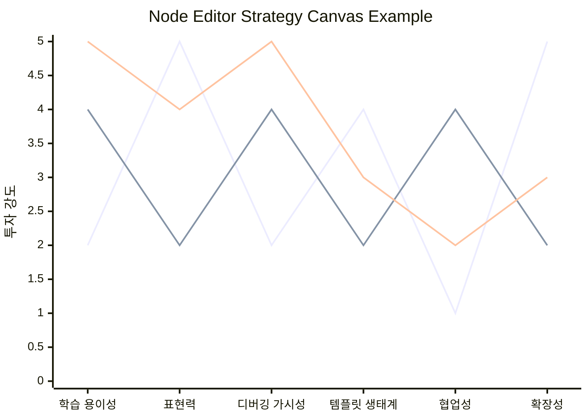
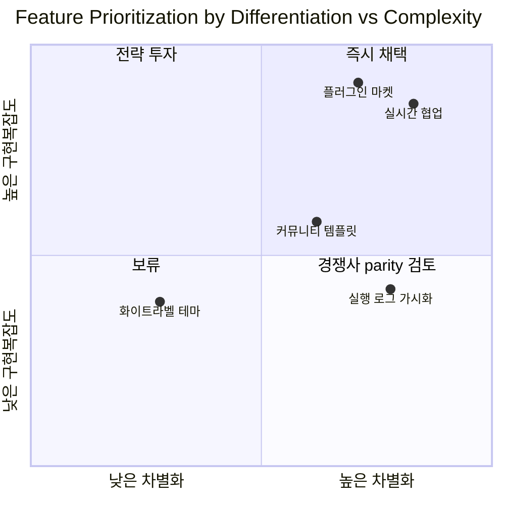
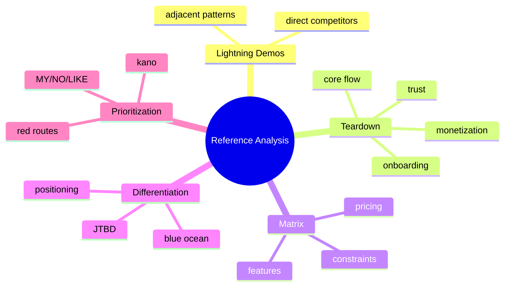

# Reference & Competitive Analysis
## 개요
`/plan-reference`는 "X 같은 앱을 만들고 싶다"류 요청에서 곧바로 기능 목록을 쓰기보다, 먼저 기존 제품을 분해하고 경쟁 구도를 재정의하며 차별화 여지를 찾는 단계에 해당한다. 특히 `ComfyUI 같은 노드 편집기`, `Notion 같은 지식도구`, `Figma 같은 협업 캔버스`처럼 이미 강한 기준 제품이 있는 카테고리에서는, 사용자가 실제로 "무엇을 고용(hire)하는지", 어떤 핵심 과업이 반복적으로 등장하는지, 어디서 마찰이 생기는지를 구조적으로 보지 않으면 곧바로 feature parity trap에 빠진다.

이 문서는 제품 기획에서 자주 섞여 쓰이는 레퍼런스 분석 프레임워크를 teardown 관점으로 재정리한 방법론 참조다. 목적은 세 가지다. 첫째, 레퍼런스 제품을 빠르게 훑는 `Lightning Demos`와 깊게 분해하는 `Competitive Teardown`을 연결한다. 둘째, 기능 비교를 단순 checkbox가 아니라 `JTBD`, `Positioning`, `Kano`, `Blue Ocean`으로 재해석한다. 셋째, 결과물을 `기능 매트릭스`, `전략 캔버스`, `차별화 포인트`, `red route` 기준으로 문서화해 planning-kit에서 바로 재사용 가능하게 만든다.

실무적으로는 다음 순서를 권장한다. `Lightning Demos -> Competitive Teardown -> Feature Matrix -> JTBD 재정의 -> Positioning/Blue Ocean -> Red Route/Kano 재적용 -> 함정 점검`. 이 흐름은 레퍼런스 수집, 비교, 차별화, 우선순위화까지를 한 묶음으로 다루며, 특정 방법론 하나에 과신하지 않고 서로의 맹점을 보완하도록 설계되어 있다.

## 1. Lightning Demos (GV Design Sprint, Jake Knapp)
### 요약
`Lightning Demos`는 짧은 시간 안에 경쟁 제품과 인접 카테고리의 모범 사례를 훑어 팀의 공통 참조면(reference surface)을 만드는 스프린트 기법이다. 핵심은 "깊게 평가"보다 "빠르게 수집하고 시각적으로 공유"하는 데 있다. 레퍼런스 제품 분석 초반에 가장 비용 대비 효율이 높다.

### 핵심 질문 · 포맷 · 체크리스트
- 무엇이 이 제품의 첫인상, 핵심 흐름, 상호작용 패턴을 정의하는가
- 사용자가 가장 빨리 가치를 느끼는 순간은 어디인가
- 구조, 언어, 시각, 온보딩, 편집 흐름 중 복제할 만한 패턴은 무엇인가
- 우리 문제를 직접 푸는 경쟁사 외에, 유사한 상호작용을 가진 인접 제품은 무엇인가

권장 포맷:
- 제품당 3분
- `1분`: 배경과 왜 참고하는지
- `1분`: 핵심 플로우 walkthrough
- `1분`: 캡처할 아이디어와 경계할 안티패턴

3분 노트 템플릿:
```md
### [제품명] Lightning Demo
- 왜 보나: 
- 대표 사용자/상황:
- 첫 화면 인상:
- 핵심 플로우 3단계:
  1. 
  2. 
  3. 
- 좋았던 패턴:
- 거슬린 마찰:
- 우리에게 가져올 것:
- 그대로 베끼면 안 되는 것:
```

체크리스트:
- 직접 경쟁사 3-5개와 인접 레퍼런스 3-5개를 섞는다
- 캡처는 화면보다 "의도" 단위로 남긴다
- 데모 종료 즉시 아이디어를 sticky 형태로 분리한다
- 이 단계에서는 우열 판단보다 패턴 수집에 집중한다

### 적용 시점
문제 정의 직후, PRD 초안 전에 가장 적합하다. 새로운 카테고리 진입, 생소한 UI 패턴 탐색, 팀 내 참조 불일치 해소에 특히 유용하다.

### 한계 · 주의
- 얕게 보면 "보기 좋은 화면 수집"으로 전락한다
- 경쟁 제품의 비즈니스 모델, 제약, 기술 부채는 보이지 않는다
- 팀이 강한 레퍼런스 하나에 과몰입하면 초반부터 모방 편향이 생긴다

### 출처
- GV Sprint, "Lightning Demos" https://www.gv.com/sprint/
- Jake Knapp, *Sprint* resources / Sprint book site https://www.thesprintbook.com/

## 2. Competitive Teardown (IDEO, NN/g)
### 요약
`Competitive Teardown`은 경쟁 제품을 사용자 흐름, 정보구조, 인터랙션, 카피, 가격, 신뢰 장치, 성장 루프까지 분해해 "무엇이 어떻게 작동하는가"를 분석하는 방식이다. `Lightning Demos`가 breadth 중심이라면 teardown은 depth 중심이다.

### 핵심 질문 · 포맷 · 체크리스트
- 핵심 사용자 과업별로 어떤 화면, 규칙, 마이크로카피, 제한 조건이 배치되어 있는가
- 진입 장벽을 낮추는 장치는 무엇인가
- 결제, 협업, 공유, 템플릿, 자동화 같은 확장 기능은 어느 지점에 삽입되는가
- 어떤 UX 결정이 비즈니스 목표와 직접 연결되는가

권장 teardown 포맷:
- `대상 제품`
- `대표 JTBD`
- `핵심 플로우 1-3개`
- `화면 캡처 + 단계별 메모`
- `가설: 이 설계가 존재하는 이유`
- `복제 가능 요소 / 차별화 필요 요소 / 폐기할 요소`

체크리스트:
- 로그인 전후 경험을 분리해 본다
- empty state, error state, export/share state를 반드시 본다
- 가격/플랜 벽이 어디서 등장하는지 기록한다
- "기능 있음/없음"이 아니라 "기능이 언제, 어떤 비용으로 드러나는가"를 기록한다

### 적용 시점
레퍼런스 수집이 끝난 뒤, 실제로 만들 제품의 핵심 플로우를 설계하기 전. 경쟁사 2-4개를 정밀 해부할 때 적합하다.

### 한계 · 주의
- 화면 분해만으로는 고객의 구매 동기와 유지 이유를 알 수 없다
- teardown 결과를 기능 목록으로만 변환하면 parity trap으로 이어진다
- "왜 이렇게 설계했는가"는 추론일 뿐이므로 사실과 추론을 분리해 적어야 한다

### 출처
- IDEO Design Kit, analogous inspiration / inspiration methods https://www.designkit.org/methods/analogous-inspiration.html
- NN/g, heuristic-based expert review reference https://media.nngroup.com/media/articles/attachments/Heuristic_Summary1_Letter-compressed.pdf

## 3. Value Proposition Canvas (Osterwalder)
### 요약
`Value Proposition Canvas`는 고객의 `Jobs, Pains, Gains`와 제품의 `Products & Services, Pain Relievers, Gain Creators`를 맞물리게 보는 도구다. 레퍼런스 분석에 적용하면 "경쟁사가 어떤 pain을 얼마나 직접적으로 줄이는가"를 비교할 수 있다.

### 핵심 질문 · 포맷 · 체크리스트
- 사용자는 이 카테고리의 제품을 어떤 일을 끝내기 위해 고용하는가
- 현재 대안에서 가장 짜증나는 pain은 무엇인가
- 경쟁사는 어떤 gain을 과장하고, 어떤 pain은 외면하는가
- 우리 제품이 깨끗하게 해결할 pain 하나는 무엇인가

권장 포맷:
- 고객 프로파일: `Jobs / Pains / Gains`
- 가치 맵: `기능 / pain reliever / gain creator`
- 경쟁사별로 같은 캔버스를 축약 작성

체크리스트:
- 기능을 적기 전에 고객 job을 먼저 적는다
- pain은 빈도와 심각도를 분리한다
- "좋아 보이는 기능"보다 "불편 제거"에 점수를 높게 준다

### 적용 시점
기능 매트릭스를 만든 뒤, 단순 기능 비교를 고객 가치 언어로 번역할 때 적합하다.

### 한계 · 주의
- 고객 인터뷰 없이 작성하면 팀의 추측을 예쁘게 정리한 문서가 되기 쉽다
- B2B나 멀티사이드 마켓에서는 고객 세그먼트를 분리하지 않으면 오판한다

### 출처
- Strategyzer, Value Proposition Canvas instruction manual https://www.strategyzer.com/resources/canvas-tools-guides/the-value-proposition-canvas-instruction-manual
- Strategyzer, Value Proposition design resources https://www.strategyzer.com/library/the-value-proposition-canvas

## 4. Feature Matrix / Comparison Grid
### 요약
`Feature Matrix`는 제품 간 기능, 품질, 제약, 가격, 협업성, API, 학습곡선 등을 표 형태로 비교하는 기본 도구다. 다만 잘못 쓰면 checkbox 수집기가 되므로, 반드시 `JTBD`, `red route`, `Kano` 해석과 같이 써야 한다.

### 핵심 질문 · 포맷 · 체크리스트
- 사용자가 실제로 자주 쓰는 핵심 기능은 무엇인가
- 각 기능은 "있다/없다"가 아니라 어느 수준까지 완성되어 있는가
- 기능의 발견 가능성, 기본값, 공유성, 자동화 가능성은 어떤가
- 기능이 제품 포지셔닝과 수익모델에 어떻게 연결되는가

체크리스트:
- `존재 여부`, `완성도`, `발견 가능성`, `제약`, `가격 연동`, `차별화 코멘트`를 함께 적는다
- 코어 플로우 기준 기능과 edge-case 기능을 분리한다
- "우리도 넣자" 결론 대신 "왜 여기서 중요해졌나"를 적는다

### 적용 시점
teardown 후반, 설계 의사결정과 범위 조정 직전에 사용한다.

### 한계 · 주의
- 열(column)이 늘수록 오히려 중요한 차이가 묻힌다
- 정성적 품질 차이를 한 칸으로 압축하면 오판한다
- 비교 대상 선정이 잘못되면 결과가 왜곡된다

### 출처
- April Dunford, positioning components and competitive alternatives https://www.aprildunford.com/post/an-introduction-to-positioning [dated: 2020-05]
- Blue Ocean Strategy, strategy canvas overview https://www.blueoceanstrategy.com/tools/strategy-canvas/

## 5. JTBD 경쟁 재정의 (Jobs to Be Done Reframing)
### 요약
`JTBD` 관점에서는 경쟁사가 같은 카테고리 제품만이 아니다. 사용자가 같은 job을 끝내기 위해 고용하는 모든 대안이 경쟁이다. 즉 `ComfyUI`의 경쟁은 다른 노드 편집기만이 아니라, 스크립트, 템플릿 마켓, SaaS 워크플로 도구, 심지어 수작업 프로세스일 수 있다.

### 핵심 질문 · 포맷 · 체크리스트
- 고객이 실제로 끝내려는 일은 무엇인가
- 현재 무엇을 대신 고용하고 있는가
- "기능 경쟁"이 아니라 "진보(progress) 경쟁"으로 보면 대안 집합이 어떻게 달라지는가
- non-consumption은 어떤 형태로 존재하는가

권장 포맷:
- `핵심 Job`
- `현재 고용 대안`
- `switching trigger`
- `desired outcome`
- `anxieties / habits`

체크리스트:
- 경쟁사를 카테고리 기준이 아니라 job 기준으로 재목록화한다
- 사용자가 지금 쓰는 우회 수단을 반드시 포함한다
- "왜 아직 안 바꿨는가"를 기능 부족보다 습관, 리스크, 학습비용으로 본다

### 적용 시점
기능 비교 이후 반드시 한 번 적용한다. 이 단계를 거치지 않으면 범주 오류(category error)로 경쟁 구도를 좁게 본다.

### 한계 · 주의
- job을 너무 추상화하면 모든 제품이 경쟁처럼 보인다
- 반대로 job을 너무 좁히면 differentiation 기회가 사라진다

### 출처
- Alan Klement, JTBD articles hub https://www.alanklement.com/
- Clayton Christensen et al., "Know Your Customers' Jobs to Be Done" https://hbr.org/2016/09/know-your-customers-jobs-to-be-done [dated: 2016-09]

## 6. Porter's Five Forces (간략)
### 요약
`Five Forces`는 제품 단위가 아니라 산업 구조 단위에서 압력을 읽는 틀이다. teardown 문맥에서는 "왜 경쟁사들이 비슷한 기능 세트를 가지게 되는가", "왜 가격/유통/API 전략이 그렇게 수렴하는가"를 해석하는 데 유용하다.

### 핵심 질문 · 포맷 · 체크리스트
- 신규 진입자의 위협은 어느 정도인가
- 대체재의 위협은 무엇인가
- 공급자와 구매자의 교섭력은 어디에 몰려 있는가
- 기존 경쟁 강도는 기능, 가격, 배포, 데이터 중 어디에서 높아지는가

권장 포맷:
- 각 force를 `낮음/중간/높음`
- 근거를 2-3줄
- 제품 설계에 미치는 함의 한 줄

### 적용 시점
시장 진입 가능성, moat, 번들링 위험, 플랫폼 종속성을 빠르게 읽을 때 사용한다.

### 한계 · 주의
- 세밀한 UX 의사결정을 직접 도와주지는 않는다
- 빠르게 변하는 소프트웨어 시장에서는 정태적 분석으로 끝나기 쉽다

### 출처
- Michael Porter, "The Five Competitive Forces That Shape Strategy" https://hbr.org/2008/01/the-five-competitive-forces-that-shape-strategy [dated: 2008-01]
- Michael Porter, "How Competitive Forces Shape Strategy" https://hbr.org/1979/03/how-competitive-forces-shape-strategy [dated: 1979-03]

## 7. Blue Ocean Strategy Canvas / Four Actions Framework
### 요약
`Strategy Canvas`는 업계가 경쟁하는 요소와 각 제품의 투자 강도를 한 눈에 비교하게 해준다. `Four Actions Framework`는 `Eliminate / Reduce / Raise / Create`로 차별화 결정을 강제한다. 경쟁사 teardown 결과를 전략 수준으로 끌어올리는 데 가장 유용한 도구 중 하나다.

### 핵심 질문 · 포맷 · 체크리스트
- 업계가 당연시하는 경쟁 요소는 무엇인가
- 우리는 무엇을 제거, 축소, 강화, 새로 만들 것인가
- 경쟁사와 다른 곡선을 만들려면 어떤 기능을 의도적으로 버려야 하는가

체크리스트:
- 축(axis)은 기능명이 아니라 구매 기준으로 잡는다
- 곡선 차이를 설명할 수 있어야 한다
- `Create`보다 `Eliminate/Reduce`를 먼저 검토한다

### 적용 시점
차별화 포인트를 정리하고, 범위 축소와 포지셔닝 문장을 만들기 직전.

### 한계 · 주의
- 예쁜 곡선 그리기에 빠지면 실행 가능성이 사라진다
- 지나친 역행(differentiation for differentiation's sake)은 오히려 가치 파괴가 된다

### 출처
- Blue Ocean Strategy, Strategy Canvas https://www.blueoceanstrategy.com/tools/strategy-canvas/
- Blue Ocean Strategy, Four Actions Framework https://www.blueoceanstrategy.com/tools/four-actions-framework/

## 8. Red Route Analysis (critical path 중심)
### 요약
`Red Route Analysis`는 사용자가 가장 자주, 가장 중요하게 수행하는 과업 경로를 식별하고 그 성공률과 마찰을 최우선으로 다루는 실무 기법이다. 용어 자체는 GOV.UK 서비스 디자인 실무에서 널리 쓰였고, NN/g의 `critical tasks`, `top tasks`, `task success` 관점과 결이 맞다. 레퍼런스 제품 분석에서는 "경쟁사 전체 기능"보다 "가장 중요한 2-3개 경로"를 먼저 비교하게 만들어 준다.

### 핵심 질문 · 포맷 · 체크리스트
- 이 제품에서 실패하면 안 되는 과업은 무엇인가
- 사용 빈도와 비즈니스 중요도가 동시에 높은 경로는 무엇인가
- 경쟁사는 red route에서 몇 단계, 어떤 결정을 요구하는가
- 우리 제품이 한 단계라도 줄일 수 있는가

권장 포맷:
- `Route name`
- `사용 빈도`
- `비즈니스 중요도`
- `현재 단계 수`
- `마찰 지점`
- `개선 기회`

체크리스트:
- 전체 기능이 아니라 top task 3개부터 선정한다
- 각 route의 성공 정의를 정한다
- empty/error/loading/collaboration 상태까지 route에 포함한다

### 적용 시점
기능 매트릭스 이후, MVP 범위와 UX 우선순위를 고를 때 가장 유용하다.

### 한계 · 주의
- 희귀하지만 전략적으로 중요한 edge case를 과소평가할 수 있다
- 데이터 없이 팀 추정으로만 route를 고르면 정치적 우선순위 싸움이 된다

### 출처
- NN/g, task-focused usability heuristics summary https://media.nngroup.com/media/articles/attachments/Heuristic_Summary1_Letter-compressed.pdf
- GOV.UK service design and user journey guidance https://www.local.gov.uk/our-support/transformation/transformation-capability-framework/design-journey [dated: 2024-??]

## 9. Positioning (April Dunford, Obviously Awesome)
### 요약
`Positioning`은 메시지 작성이 아니라, 어떤 시장 범주에서 어떤 대안 대비 왜 이길 자격이 있는지를 정의하는 일이다. 경쟁사 teardown의 결과를 전략 문장으로 압축하는 데 필요하다.

### 핵심 질문 · 포맷 · 체크리스트
- 우리의 경쟁 대안은 정확히 무엇인가
- 차별화된 capability는 무엇인가
- 그 capability가 고객 가치로 어떻게 번역되는가
- 어떤 고객 세그먼트에서 이 설명이 가장 설득력 있는가
- 어떤 시장 category에 넣어야 가장 잘 이해되는가

권장 포맷:
- `Competitive alternatives`
- `Unique capabilities`
- `Value themes`
- `Best-fit customers`
- `Market category`

체크리스트:
- 차별점은 기능명이 아니라 "가치 차이"까지 연결한다
- 경쟁 대안을 넓게 잡되, 구매 시점의 실제 비교군을 반영한다
- 제품 설명보다 category choice를 먼저 검토한다

### 적용 시점
차별화 포인트 정리, 홈페이지 카피, PRD intro, launch brief 작성 전에 사용한다.

### 한계 · 주의
- 너무 이른 시점에 포지셔닝을 고정하면 제품 탐색이 경직된다
- 실제 제품 경험이 뒷받침되지 않으면 positioning은 빈 약속이 된다

### 출처
- April Dunford, "An Introduction to Positioning" https://www.aprildunford.com/post/an-introduction-to-positioning [dated: 2020-05]
- Obviously Awesome book / resources https://www.aprildunford.com/obviously-awesome

## 10. Flywheel / Moat Analysis
### 요약
`Flywheel`은 제품 사용, 데이터 축적, 공유, 콘텐츠, 템플릿, 네트워크, 신뢰가 서로를 강화하는 순환 구조를 찾는 도구다. `Moat analysis`는 그 순환이 얼마나 모방 저항성을 가지는지 본다. teardown에서는 경쟁사의 기능이 아니라 "왜 시간이 갈수록 강해지는가"를 읽는 데 중요하다.

### 핵심 질문 · 포맷 · 체크리스트
- 이 제품은 사용할수록 무엇이 더 좋아지는가
- 데이터, 네트워크, 전환비용, 브랜드, 생태계 중 어떤 moat가 작동하는가
- 경쟁사가 가진 선순환의 입력과 출력은 무엇인가
- 우리는 같은 flywheel을 따라갈지, 다른 flywheel을 설계할지

권장 포맷:
- `Trigger -> Usage -> Data/Content -> Better outcomes -> More adoption`
- 각 단계별 증거
- 모방 난이도 평가

체크리스트:
- loop가 실제로 닫히는지 확인한다
- 네트워크 효과와 규모의 경제를 혼동하지 않는다
- "있으면 좋다"가 아니라 반복될수록 강해지는 메커니즘만 남긴다

### 적용 시점
단기 기능 우선순위가 아니라, 왜 이 제품이 장기적으로 방어력을 갖는지 판단할 때.

### 한계 · 주의
- flywheel이 있다고 가정하고 억지로 선을 잇기 쉽다
- 초기 제품 단계에서는 loop보다 선형 성장 장치가 더 중요할 수 있다

### 출처
- Jim Collins, *Turning the Flywheel* overview https://www.jimcollins.com/books/turningtheflywheel.html [dated: 2019-01]
- a16z, "Not all Network Effects Are Created Equal" https://a16z.com/podcast/a16z-podcast-not-all-network-effects-are-created-equal/ [dated: 2016-08]

## 11. MY/NO/LIKE 기법
### 요약
`MY/NO/LIKE`는 표준 학술 프레임워크라기보다 teardown 회의에서 빠르게 쓰는 실무 shorthand로 보는 편이 정확하다. 여기서는 이를 `MY = 우리 제품이 반드시 자기 것으로 삼을 것`, `NO = 의도적으로 하지 않을 것`, `LIKE = 참고하되 그대로 복제하지 않을 것`으로 정의한다. 즉, 레퍼런스 분석 결과를 채택/비채택/변형 채택으로 가르는 decision lens다.

### 핵심 질문 · 포맷 · 체크리스트
- 이것이 우리 포지셔닝과 맞는가
- 경쟁사가 이 기능을 잘하는 이유가 우리에게도 유효한가
- 그대로 가져오면 사용자 기대와 제품 복잡도가 어떻게 변하는가
- "좋아 보임"과 "우리에게 맞음"을 구분했는가

권장 포맷:
- `MY`: 핵심 차별화 또는 핵심 route에 직접 기여
- `NO`: 포지셔닝을 흐리거나 복잡도만 높임
- `LIKE`: 패턴은 유효하지만 구현은 변형 필요

체크리스트:
- 각 항목마다 근거를 한 줄 이상 적는다
- `NO`가 충분히 많아야 한다
- `LIKE`는 언제든 `MY`로 오해되기 쉬우므로 적용 조건을 적는다

### 적용 시점
기능 매트릭스와 teardown 메모를 실제 제품 방향성으로 압축할 때.

### 한계 · 주의
- 공식 정의가 고정된 방법론이 아니므로 팀 합의된 의미를 먼저 명시해야 한다
- 감상평 분류로 흐르면 전략 가치가 없다

### 출처
- April Dunford positioning resources https://www.aprildunford.com/post/an-introduction-to-positioning [dated: 2020-05]
- Blue Ocean Strategy, Four Actions Framework https://www.blueoceanstrategy.com/tools/four-actions-framework/

## 12. Kano Model 재적용
### 요약
`Kano Model`은 기능을 `Must-be`, `Performance`, `Attractive`, `Indifferent` 등으로 분류해 사용자 만족과 불만족의 비대칭을 파악하는 틀이다. 경쟁사 teardown 후 다시 적용하면 "경쟁사가 다 갖춘 기능이라도 이제는 위생요인인가"를 판단할 수 있다.

### 핵심 질문 · 포맷 · 체크리스트
- 없으면 불만이지만 있어도 큰 감동이 없는 기능은 무엇인가
- 제공 수준이 높을수록 선형적으로 가치가 커지는 기능은 무엇인가
- 경쟁사가 아직 약한 delighter는 무엇인가
- 우리가 실수로 indifferent 기능에 과투자하고 있지 않은가

권장 포맷:
- 기능별 `Must-be / Performance / Attractive / Indifferent / Reverse`
- 경쟁사 기준 현재 기대수준 메모

체크리스트:
- 현재 시장 기대치를 반영해 재분류한다
- early adopter와 mainstream을 분리해 본다
- delight 기능이 red route를 해치지 않는지 본다

### 적용 시점
기능 우선순위화, MVP 범위 조정, 차별화 후보 검토 시.

### 한계 · 주의
- 설문 설계가 부정확하면 분류 신뢰도가 낮다
- 카테고리 성숙도에 따라 분류가 빠르게 이동한다

### 출처
- Noriaki Kano et al., "Attractive Quality and Must-be Quality" citation record https://www.scirp.org/reference/referencespapers?referenceid=1217282 [dated: 1984-01]
- Kano model overview / practical explainer for product teams https://www.qualtrics.com/experience-management/customer/kano-analysis/ [dated: 2024-??]

## 13. Heuristic Evaluation (Nielsen 10 Heuristics)
### 요약
`Heuristic Evaluation`은 인터페이스를 보편적 사용성 원칙으로 점검하는 전문가 리뷰 방식이다. 경쟁사 teardown에 결합하면, 단순 취향 비평이 아니라 공통 기준으로 UX 품질을 비교할 수 있다.

### 핵심 질문 · 포맷 · 체크리스트
- 시스템 상태 가시성은 충분한가
- 사용자 언어와 실제 세계의 대응은 자연스러운가
- 되돌리기, 에러 예방, 인지부하 최소화는 어떤 수준인가
- 미니멀리즘과 효율성 사이 균형은 적절한가

권장 포맷:
- 휴리스틱 10개를 행으로
- 제품별 위반 사례와 심각도
- red route 영향 메모

체크리스트:
- aesthetic critique와 heuristic violation을 구분한다
- 한 화면이 아니라 end-to-end flow로 본다
- 에러 메시지와 빈 상태를 반드시 포함한다

### 적용 시점
UX teardown의 공통 채점표가 필요할 때, 혹은 경쟁사 2-3개를 일관되게 비교할 때.

### 한계 · 주의
- 도메인 특화 UX 문제는 휴리스틱만으로 잡히지 않는다
- 평가자 편차가 크므로 근거 캡처를 남겨야 한다

### 출처
- NN/g, "Jakob's Ten Usability Heuristics" summary PDF https://media.nngroup.com/media/articles/attachments/Heuristic_Summary1_Letter-compressed.pdf
- NN/g article URL referenced by the PDF https://www.nngroup.com/articles/ten-usability-heuristics/

## 14. UX Teardown 템플릿 (Growth.Design, UX Collective)
### 요약
실무 teardown 템플릿은 보통 `목표 행동`, `화면 캡처`, `가설`, `심리학/인지 원리`, `개선 아이디어`로 구성된다. Growth.Design은 behavioral design lens를, UX Collective는 case-study형 해설 포맷을 제공해 teardown 문서의 서술 방식에 참고가 된다.

### 핵심 질문 · 포맷 · 체크리스트
- 이 화면은 어떤 행동을 유도하려는가
- 어떤 심리적 장치 또는 인지 부하 감소 전략을 쓰는가
- 무엇이 분명하고, 무엇이 암묵적인가
- 전환과 신뢰 형성에 어떤 장면이 결정적 역할을 하는가

권장 포맷:
- `Step`
- `Screenshot`
- `Observed pattern`
- `Why it likely exists`
- `User impact`
- `Reuse / Avoid / Differentiate`

체크리스트:
- 캡처는 흐름 단위로 정렬한다
- 관찰과 해석을 분리한다
- persuasion과 dark pattern을 구분한다

### 적용 시점
teardown 산출물을 팀 위키나 planning-kit 문서로 남길 때.

### 한계 · 주의
- 템플릿이 너무 정교하면 오히려 기록 비용이 높아진다
- 심리학 해석은 과잉추론이 되기 쉽다

### 출처
- Growth.Design case studies hub https://growth.design/case-studies/
- UX Collective publication home https://uxdesign.cc/

## 15. Feature Parity Trap
### 요약
`Feature Parity Trap`은 경쟁사의 기능 목록을 따라가다 제품 전략이 흐려지고 복잡도만 누적되는 함정이다. 용어는 실무에서 널리 쓰이지만, 핵심 문제 자체는 `Positioning`, `Blue Ocean`, `JTBD` 문헌에서 반복적으로 경고해 온 주제다.

### 핵심 질문 · 포맷 · 체크리스트
- 이 기능은 경쟁사가 있어서 넣는가, 우리 가치 제안을 강화해서 넣는가
- 없으면 판매가 막히는가, 아니면 단지 열세처럼 보이는가
- 이 기능이 onboarding, IA, pricing, support cost를 얼마나 복잡하게 만드는가
- parity를 채우는 대신 제거하거나 축소할 수 있는 것은 무엇인가

체크리스트:
- `deal-breaker parity`와 `vanity parity`를 구분한다
- 경쟁사 따라잡기 backlog를 red route 기준으로 다시 본다
- `NO` 결정 근거를 명시한다

### 적용 시점
범위가 늘어나기 시작할 때, 특히 영업 요구/커뮤니티 요구가 뒤섞일 때.

### 한계 · 주의
- parity를 무시하자는 뜻이 아니다
- 위생요인조차 무시하면 시장 진입 자체가 막힐 수 있다

### 출처
- April Dunford positioning resources https://www.aprildunford.com/post/an-introduction-to-positioning [dated: 2020-05]
- Blue Ocean Strategy, Four Actions Framework https://www.blueoceanstrategy.com/tools/four-actions-framework/

## 16. Survivorship Bias
### 요약
`Survivorship Bias`는 눈에 띄는 성공 제품만 보고 그 특징을 성공 원인으로 착각하는 편향이다. 레퍼런스 분석에서는 "잘된 제품이 채택한 기능"만 모으기 쉽기 때문에 특히 위험하다.

### 핵심 질문 · 포맷 · 체크리스트
- 실패한 제품이나 철수한 기능은 무엇이었는가
- 성공 제품의 기능 중 어떤 것은 결과이지 원인이 아닐 수 있는가
- 같은 기능을 했지만 실패한 사례가 있는가
- 보이지 않는 유통력, 브랜드, 네트워크 효과를 무시하고 있지 않은가

체크리스트:
- winner만 보지 말고 late entrant, shutdown 사례도 본다
- 기능 성공과 distribution success를 분리한다
- "지금도 유효한가"를 시장 시점으로 검토한다

### 적용 시점
레퍼런스 수집이 어느 정도 끝난 뒤, 결론을 내리기 직전에 편향 점검용으로 사용한다.

### 한계 · 주의
- 실패 사례의 정보 접근성이 낮다
- 지나치게 회의적으로 접근하면 학습 속도가 떨어질 수 있다

### 출처
- HBR, jobs-to-be-done and causation lens https://hbr.org/2016/09/know-your-customers-jobs-to-be-done [dated: 2016-09]
- Strategyzer resources hub for evidence-based innovation https://www.strategyzer.com/resources

## 기능 매트릭스 포맷
아래 포맷은 `존재 여부`만이 아니라 `완성도`, `발견 가능성`, `제약`, `차별화 해석`까지 기록하도록 설계했다.

```md
| Capability | User Job | Red Route? | Product A | Product B | Product C | Our Take |
|---|---|---:|---|---|---|---|
| 노드 캔버스 편집 | 복잡한 워크플로 시각 조합 | Y | 강함: 드래그/줌 자연스러움 | 중간: 캔버스는 있으나 대형 그래프 약함 | 약함: 폼 기반 우회 | MY - 코어 경험 |
| 템플릿 시작 | 빠르게 시작 | Y | 강함: 커뮤니티 템플릿 풍부 | 약함: 기본 예제 적음 | 중간: 공식 템플릿만 | LIKE - 초기 진입만 단순화 |
| 실행/디버깅 로그 | 실패 원인 파악 | Y | 중간: 로그는 상세하나 난해 | 강함: 단계별 상태 명확 | 약함 | MY - 상태 가시성 차별화 |
| 협업 공유 링크 | 팀과 결과 공유 | N | 약함 | 강함 | 중간 | NO - v1 범위 제외 |
| 플러그인 확장 | 전문 사용자 확장 | N | 강함 | 중간 | 약함 | LIKE - API 먼저, 마켓은 후순위 |
```

평가 기호 권장:
- `강함 / 중간 / 약함`
- 필요 시 `없음 / 제한적 / 유료 / 엔터프라이즈만` 보조 표기
- `Our Take`는 `MY / NO / LIKE` 또는 `Must / Later / Avoid`로 통일

### Mermaid 예시 1: Strategy Canvas


### Mermaid 예시 2: quadrantChart (v10.6+)


### Mermaid 예시 3: teardown mindmap


## Strategy Canvas 예시 해석
예를 들어 `ComfyUI 같은 노드 편집기`를 만든다면, 업계 공통 경쟁 요소를 `학습 용이성`, `표현력`, `디버깅 가시성`, `템플릿 생태계`, `협업성`, `확장성`으로 둘 수 있다. 여기서 기존 강자들이 `표현력`과 `확장성`에 과투자하고 `학습 용이성`과 `디버깅 가시성`이 낮다면, 우리 곡선은 `Raise: 학습 용이성, 디버깅 가시성`, `Reduce: 범용 확장성`, `Eliminate: 초기 복잡 설정`, `Create: guided debug flow`가 된다. 이때 차별화는 "기능이 더 많다"가 아니라 "복잡한 워크플로를 더 빨리 성공시키게 한다"라는 가치로 번역되어야 한다.

## 실무 적용 순서 제안
1. `Lightning Demos`로 직접 경쟁사와 인접 레퍼런스를 6-10개 수집한다.
2. 상위 2-4개 제품에 `Competitive Teardown`을 적용한다.
3. 결과를 `Feature Matrix`로 정리하되, checkbox가 아니라 완성도와 제약까지 적는다.
4. `JTBD`로 경쟁 집합을 다시 정의하고 non-consumption을 포함한다.
5. `Positioning`과 `Blue Ocean`으로 차별화 문장을 만든다.
6. `Red Route`와 `Kano`로 실제 MVP 우선순위를 줄인다.
7. 마지막으로 `Feature Parity Trap`과 `Survivorship Bias`를 체크해 결론을 교정한다.

## 참고 링크
- GV Sprint: https://www.gv.com/sprint/
- Sprint book site: https://www.thesprintbook.com/
- IDEO Design Kit: https://www.designkit.org/
- IDEO Design Kit, Analogous Inspiration: https://www.designkit.org/methods/analogous-inspiration.html
- Strategyzer resources: https://www.strategyzer.com/resources
- Strategyzer, Value Proposition Canvas instruction manual: https://www.strategyzer.com/resources/canvas-tools-guides/the-value-proposition-canvas-instruction-manual
- Strategyzer library, Value Proposition Canvas: https://www.strategyzer.com/library/the-value-proposition-canvas
- Alan Klement: https://www.alanklement.com/
- HBR, Know Your Customers' Jobs to Be Done: https://hbr.org/2016/09/know-your-customers-jobs-to-be-done
- HBR, The Five Competitive Forces That Shape Strategy: https://hbr.org/2008/01/the-five-competitive-forces-that-shape-strategy
- HBR, How Competitive Forces Shape Strategy: https://hbr.org/1979/03/how-competitive-forces-shape-strategy
- Blue Ocean Strategy, Strategy Canvas: https://www.blueoceanstrategy.com/tools/strategy-canvas/
- Blue Ocean Strategy, Four Actions Framework: https://www.blueoceanstrategy.com/tools/four-actions-framework/
- NN/g, Ten Usability Heuristics article: https://www.nngroup.com/articles/ten-usability-heuristics/
- NN/g, Heuristics summary PDF: https://media.nngroup.com/media/articles/attachments/Heuristic_Summary1_Letter-compressed.pdf
- April Dunford, An Introduction to Positioning: https://www.aprildunford.com/post/an-introduction-to-positioning
- April Dunford, Obviously Awesome: https://www.aprildunford.com/obviously-awesome
- Jim Collins, Turning the Flywheel: https://www.jimcollins.com/books/turningtheflywheel.html
- a16z, Not all Network Effects Are Created Equal: https://a16z.com/podcast/a16z-podcast-not-all-network-effects-are-created-equal/
- Growth.Design case studies: https://growth.design/case-studies/
- UX Collective: https://uxdesign.cc/
- Kano citation record: https://www.scirp.org/reference/referencespapers?referenceid=1217282
- Qualtrics, Kano Analysis explainer: https://www.qualtrics.com/experience-management/customer/kano-analysis/
- Local Government Association, customer or user journey mapping: https://www.local.gov.uk/our-support/transformation/transformation-capability-framework/design-journey
