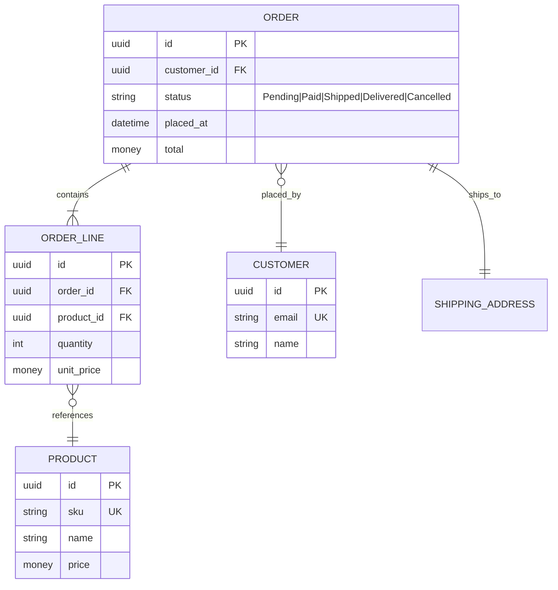
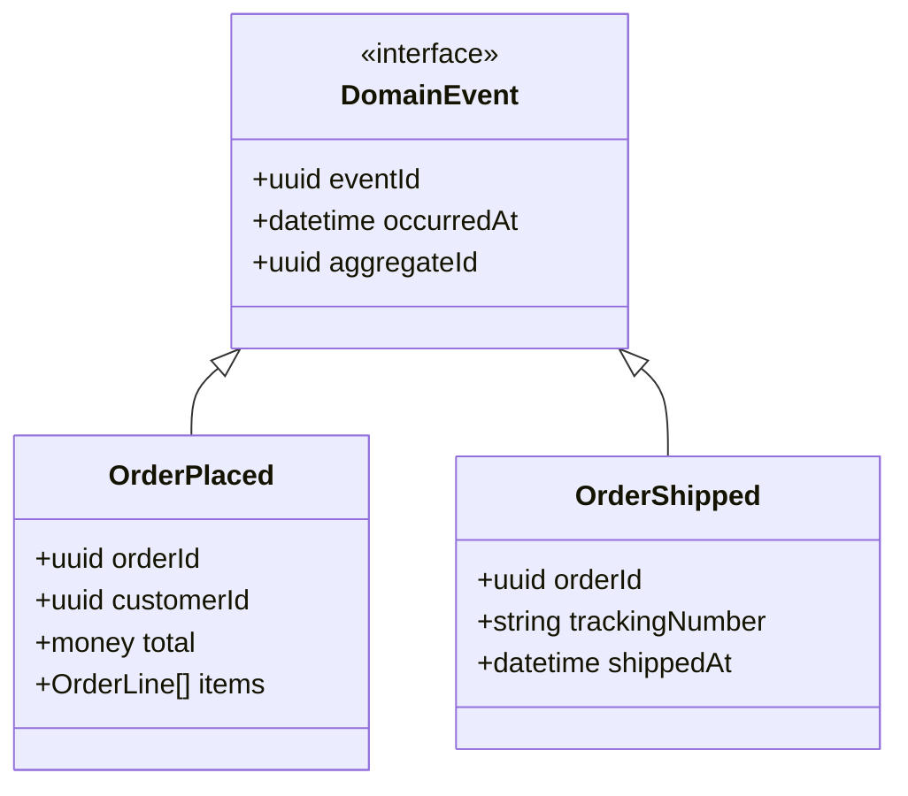

# Gotchas

1. **구현 스키마로 점프 금지** — 이 스킬은 **개념 모델**이다. `VARCHAR(255)`, 인덱스, FK 제약 등 구현 디테일 금지. 구현은 backend-kit/rust-kit 가 담당.
2. **CRUD 함정** — 모든 기능을 "X 를 Create/Read/Update/Delete" 로 환원하면 도메인 이벤트가 사라진다. "OrderPlaced", "PaymentRefunded" 같은 **사건 중심** 모델링 선행.
3. **Aggregate 경계 누락 금지** — 엔티티를 나열만 하고 경계를 안 그으면 의존성이 폭발한다. 각 Aggregate 의 **Root** 를 명시.
4. **Mermaid erDiagram 카디널리티 표기** — `||--o{` = one-to-many, `}o--o{` = many-to-many, `||--||` = one-to-one. 틀리면 잘못된 스키마로 구현된다.
5. **Value Object vs Entity 구분** — ID 로 식별되면 Entity, 값 자체로 식별되면 Value Object. Money, Address, DateRange 는 VO.
6. **Domain Event 는 과거형으로** — "CreateUser" ✗, "UserRegistered" ✓. 이벤트는 이미 일어난 사실.
7. **Data Dictionary 없이 진행 금지** — 각 필드의 정의/제약/출처를 명시하지 않으면 팀마다 다른 해석이 생긴다.
8. **Mermaid erDiagram 문법** — 필드는 `type name PK/FK/UK "comment"` 순서. 타입은 개념 레벨로만 (string/int/datetime/uuid). DB 타입(VARCHAR) 쓰지 마라. 출처: [Mermaid erDiagram](https://mermaid.js.org/syntax/entityRelationshipDiagram.html).
9. **DDD 용어만 붙이고 CRUD 유지 금지** — Bounded Context / Aggregate / VO / Domain Event 를 라벨링만 하고 실제 모델이 CRUD 라면 효과 없음. 모든 곳에 aggregate 를 크게 잡으면 병목 발생. 출처: [Eric Evans — DDD Reference](https://www.domainlanguage.com/ddd/reference/), [Blue Book](https://www.domainlanguage.com/ddd/blue-book/).
10. **Event Storming 이 noisy brainstorm 으로 끝나지 않게** — 벽 스티커 목적이 아니라 deliberate collective learning. 퍼실리테이션 약하면 hotspot/unknown 이 드러나지 않는다. Big Picture → Process → Software Design 단계 구분. 출처: [Alberto Brandolini — EventStorming](https://www.eventstorming.com/), [Book](https://www.eventstorming.com/book/).
11. **ERD 는 행위 규칙을 설명하지 못한다** — cardinality/optionality 는 보여주지만 상태 전이/시간 흐름은 별도 stateDiagram + Event 모델로 보완. 출처: [Mermaid erDiagram](https://mermaid.js.org/syntax/entityRelationshipDiagram.html).
12. **Data Dictionary 는 ownership 없으면 썩는다** — glossary 와 schema registry 가 분리되면 중복 관리 생김. PII/retention 필수. 출처: [DDD Reference §Model](https://www.domainlanguage.com/ddd/reference/).

# Process

## Step 0: 리서치 문서 로드

`docs/planning/data-modeling.md` (DDD, Event Storming, ERD, Mermaid 문법) 로드.

## Step 1: Event Storming (사건 먼저)

출처: [Alberto Brandolini — EventStorming](https://www.eventstorming.com/).

PRD/플로우에서 **과거형 이벤트**를 뽑아 시간순으로 나열:

```text
UserSignedUp → EmailVerified → ProfileCompleted → FirstOrderPlaced → ...
```

이벤트 10개 미만이면 단일 Bounded Context, 이상이면 복수 BC 분리 검토.

## Step 2: Bounded Context 식별

출처: [Eric Evans — DDD Bounded Context Intro](https://elearn.domainlanguage.com/modules/bcintro/), [DDD Reference](https://www.domainlanguage.com/ddd/reference/).

이벤트를 의미 단위로 묶는다:

```text
[Identity BC]      UserSignedUp, EmailVerified, PasswordReset
[Catalog BC]       ProductAdded, PriceChanged
[Ordering BC]      CartCreated, OrderPlaced, OrderShipped
[Billing BC]       InvoiceIssued, PaymentReceived, Refunded
```

각 BC 는 독립적인 언어(Ubiquitous Language) 를 갖는다. "User" 가 BC 마다 다른 의미일 수 있다.

## Step 3: Aggregate + Entity + VO 정의

각 BC 내부에:
- **Aggregate Root**: 외부에서 접근 가능한 진입점
- **Entity**: ID 로 식별, lifecycle 존재
- **Value Object**: 값 자체로 식별, immutable

```text
Ordering BC:
  Aggregate: Order (root)
    - OrderId (VO)
    - Customer (ref by CustomerId)
    - LineItems (collection of OrderLine Entity)
    - ShippingAddress (VO)
    - Status (Enum: Pending/Paid/Shipped/Delivered/Cancelled)
```

## Step 4: Mermaid erDiagram 작성



카디널리티 기호:
- `||--||` one-to-one
- `||--o{` one-to-many (optional many)
- `||--|{` one-to-many (at-least-one)
- `}o--o{` many-to-many
- `}|--||` many-to-one (required)

## Step 5: Domain Event classDiagram (선택)

이벤트 구조를 보여줄 때:



## Step 6: Data Dictionary

각 필드 정의:

```markdown
| Entity | Field | Type | Constraint | Source | Notes |
|--------|-------|------|------------|--------|-------|
| Order | id | UUID | PK, immutable | generated | v7 권장 |
| Order | status | Enum | 5 values | state machine | transitions in flow |
| Order | total | Money | ≥ 0 | sum of lines | currency 포함 |
```

## Step 7: 검증 체크리스트

- [ ] 모든 Aggregate 에 Root 가 명시되었는가
- [ ] 각 Bounded Context 가 독립적인 언어를 갖는가
- [ ] Domain Event 가 모두 과거형인가
- [ ] Mermaid erDiagram 카디널리티가 정확한가
- [ ] Value Object 가 Entity 와 구분되는가
- [ ] Data Dictionary 가 모든 필드를 커버하는가
- [ ] 구현 디테일(VARCHAR, INDEX 등) 이 섞이지 않았는가

## Step 8: 저장

`.planning/data-model-<domain>.md` 저장. 구조:

```markdown
# Data Model: <Domain>

## Events (Event Storming)
## Bounded Contexts
### <BC-1>
#### ERD (Mermaid)
#### Aggregates
#### Data Dictionary
## Cross-BC Integration (이벤트 기반)
## Open Questions
```

## Step 9: 다음 단계

- 실제 DB 스키마 → `backend-kit` / `rust-model`
- 유저 플로우와 상호 참조 → `/plan-flow` 의 sequenceDiagram 갱신
- 완성도 감사 → `/plan-audit`

# References

- `docs/planning/data-modeling.md` — DDD, Event Storming, ERD, Mermaid erDiagram/classDiagram, Data Dictionary

주요 1차 출처:
- [Eric Evans — DDD Reference](https://www.domainlanguage.com/ddd/reference/)
- [DDD Blue Book](https://www.domainlanguage.com/ddd/blue-book/)
- [Bounded Context Intro](https://elearn.domainlanguage.com/modules/bcintro/)
- [Alberto Brandolini — EventStorming](https://www.eventstorming.com/)
- [Mermaid erDiagram](https://mermaid.js.org/syntax/entityRelationshipDiagram.html)
- [Mermaid classDiagram](https://mermaid.js.org/syntax/classDiagram.html)
