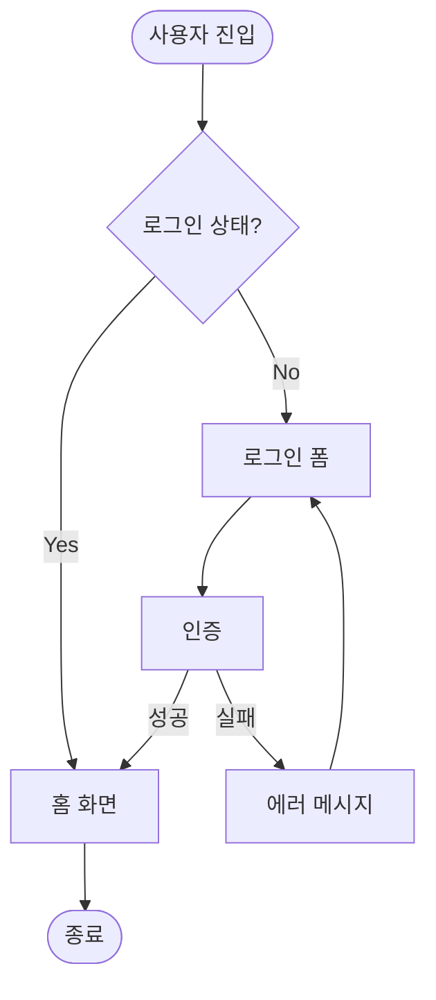
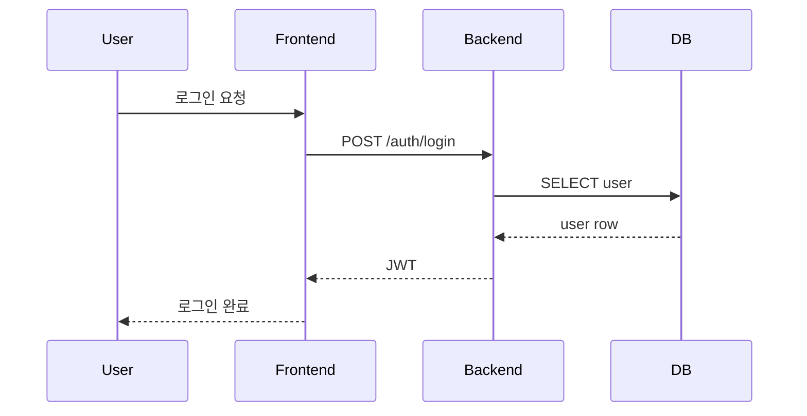
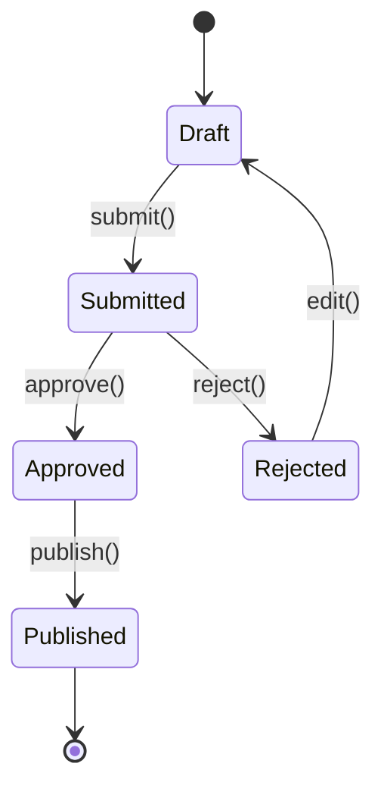
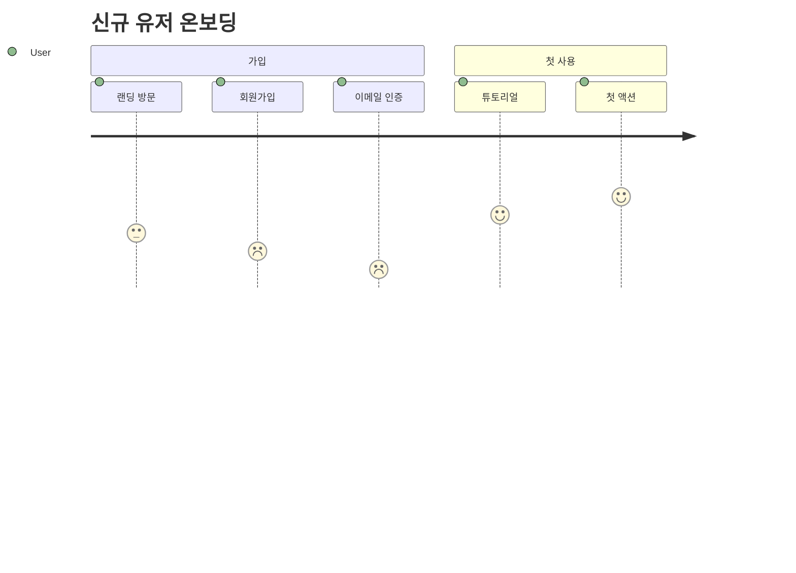

# Gotchas

1. **다이어그램 종류 혼동 금지** — User Flow(사용자 관점 화면 전환) ≠ Sequence(시스템 간 통신) ≠ State(단일 엔티티 상태) ≠ Journey(감정 포함). 목적에 맞는 것 선택.
2. **Mermaid 문법 오류 방치 금지** — 작성 후 반드시 문법 검증. 노드 이름에 특수문자(괄호, 콜론) 쓸 때 따옴표 처리. 예: `A["로그인 (OAuth)"]`.
3. **해피 패스만 그리기 금지** — 에러/취소/타임아웃 경로 최소 2개 포함. flow 의 50% 는 edge case 다.
4. **노드 너무 많으면 분할** — 한 다이어그램에 15 노드 초과하면 sub-flow 로 분할. 가독성 붕괴.
5. **방향 선택** — 순차 프로세스는 `LR`(좌→우), 계층 구조는 `TD`(상→하). 섞지 마라.
6. **Journey Map 은 감정 포함 필수** — `journey` 타입은 각 단계에 점수(1-5) 로 감정을 표현한다. 생략하면 그냥 플로우차트.
7. **Service Blueprint = Frontstage + Backstage + Support** — 블루프린트 요청 시 고객-접점(frontstage) / 직원 행위(backstage) / 시스템(support) 3층 모두 포함. 출처: [NN/g — Service Blueprints](https://www.nngroup.com/articles/service-blueprints-definition/).
8. **User Flow / Journey Map / Service Blueprint 는 대체재 아님** — 셋은 질문이 다르다. task completion 경로는 flow, 감정+맥락 포함 경험은 journey, frontstage↔backstage 운영까지는 blueprint. 하나의 도표에 셋을 섞지 마라. 출처: [NN/g — Journey Mapping 101](https://www.nngroup.com/articles/journey-mapping-101/).
9. **IA 를 사이트맵으로만 축소 금지** — 리서치 없이 taxonomy 만들면 내부 조직도 반영 문서가 된다. 라벨은 사용자 언어여야 하고, browse vs search 영역을 구분해야 한다. 출처: [Rosenfeld/Morville — Information Architecture (4th)](https://www.oreilly.com/library/view/information-architecture-4th/9781491913529/).
10. **Mermaid 예약어 충돌 방지** — `end` 같은 소문자 breaker 를 노드 ID 로 쓰지 마라, 노드 내용에 괄호/콜론 있으면 따옴표 필수. 출처: [Mermaid Flowchart Syntax](https://mermaid.js.org/syntax/flowchart.html).

# Process

## Step 0: 리서치 문서 로드

`docs/planning/flows.md` (User Flow vs Journey vs Blueprint, Mermaid 문법 패턴) 로드.

## Step 1: 다이어그램 타입 선택

| 의도 | Mermaid 타입 | 언제 | 출처 |
|------|--------------|------|------|
| 화면 전환, 결정 분기 | `flowchart TD/LR` | 일반 유저 플로우 | [Mermaid Flowchart](https://mermaid.js.org/syntax/flowchart.html) |
| 클라이언트-서버 상호작용 | `sequenceDiagram` | API 호출 흐름 | [Mermaid Sequence](https://mermaid.js.org/syntax/sequenceDiagram.html) |
| 엔티티의 상태 전이 | `stateDiagram-v2` | 주문/구독/문서 상태 | [Mermaid State](https://mermaid.js.org/syntax/stateDiagram) |
| 감정·만족도 포함 여정 | `journey` | UX Journey Map | [Mermaid User Journey](https://mermaid.js.org/syntax/userJourney), [NN/g Journey Mapping](https://www.nngroup.com/articles/journey-mapping-101/) |
| 정보 구조 (IA) | `flowchart TD` (트리 형태) | 네비게이션/사이트맵 | [Rosenfeld/Morville IA](https://www.oreilly.com/library/view/information-architecture-4th/9781491913529/) |

## Step 2: 작성

### User Flow (flowchart)

### Sequence (시스템 상호작용)

### State Machine

### Journey Map

## Step 3: Edge Case 보강

체크리스트 — 다이어그램에 포함되었는가:
- [ ] 에러 경로 (네트워크/서버/입력 오류)
- [ ] 취소 경로 (사용자 이탈)
- [ ] 권한 없음 분기
- [ ] 빈 상태 (empty)
- [ ] 로딩/대기 상태

없으면 추가.

## Step 4: 검증

- Mermaid 문법 유효성 (특수문자 escape, 노드 ID 중복 없음)
- 노드 개수 15 초과 시 sub-flow 분할
- 방향 일관성

## Step 5: 저장

`.planning/flow-<slug>.md` 저장. 한 파일에 여러 다이어그램 묶어도 됨.

## Step 6: 다음 단계

- 데이터 구조 → `/plan-data-model`
- 스토리 분해 → `/plan-stories`
- 완성도 감사 → `/plan-audit`

# References

- `docs/planning/flows.md` — User Flow / Journey Map / Service Blueprint / IA / Mermaid 공식 문법

주요 1차 출처:
- [NN/g — Journey Mapping 101](https://www.nngroup.com/articles/journey-mapping-101/)
- [NN/g — Service Blueprints](https://www.nngroup.com/articles/service-blueprints-definition/)
- [Rosenfeld/Morville — Information Architecture (4th)](https://www.oreilly.com/library/view/information-architecture-4th/9781491913529/)
- [Mermaid Flowchart](https://mermaid.js.org/syntax/flowchart.html)
- [Mermaid Sequence Diagram](https://mermaid.js.org/syntax/sequenceDiagram.html)
- [Mermaid State Diagram](https://mermaid.js.org/syntax/stateDiagram)
- [Mermaid User Journey](https://mermaid.js.org/syntax/userJourney)
