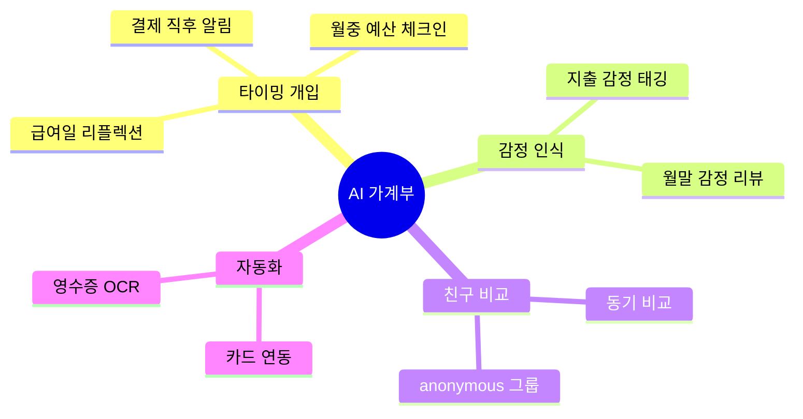

# Gotchas

1. **발산 전 수렴 금지** — "이거 좋아 보인다" 로 바로 시작하면 편향된 단일 방향만 파게 된다. 반드시 발산 단계에서 최소 8개 이상의 후보 아이디어를 만든 뒤 수렴하라. 출처: [Design Council UK — Double Diamond](https://www.designcouncil.org.uk/our-resources/the-double-diamond/).
2. **HMW 질문을 해결책으로 쓰지 마라** — "How Might We 푸시 알림을 더 자주 보낼까?" 는 해결책이 박힌 질문이다. "사용자가 중요한 순간을 놓치지 않도록 어떻게 도울 수 있을까?" 가 올바른 HMW. 명사(기능) 가 아니라 동사(결과) 중심. 출처: [Stanford d.school — Design Resources](https://dschool.stanford.edu/resources).
3. **Crazy 8s 시간 제한 지키기** — 8분 8개. 시간을 늘리면 자기검열이 시작된다. 초안은 황당해도 적어야 한다. 출처: [Google Ventures — Design Sprint](https://www.gv.com/sprint/).
4. **판단 보류 규칙** — 발산 단계에서 "그건 안될 것 같다" 금지. Alex Osborn 의 brainstorming 4 규칙 중 핵심. 평가는 수렴 단계에서만. 출처: [Creative Education Foundation — Osborn-Parnes CPS](https://www.creativeeducationfoundation.org/).
5. **단일 기법 의존 금지** — HMW 한 번 돌리고 끝내지 마라. 발산은 최소 2개 기법(HMW + Crazy 8s 또는 SCAMPER) 을 조합해야 다양성이 나온다.
6. **수렴 없이 끝내지 마라** — 아이디어 50개를 남기고 끝내면 결정 피로가 온다. 반드시 Dot Voting 또는 Impact-Effort 로 Top 3~5 로 좁혀라.
7. **그룹핑은 KJ 방식** — Affinity Diagram 은 사전 카테고리 없이 유사성만으로 묶어야 패턴이 드러난다. 카테고리 먼저 만들면 이미 가진 가설에 맞춰 분류된다. 출처: [NN/g — Affinity Diagramming](https://www.nngroup.com/articles/affinity-diagram/).
8. **Mermaid mindmap 은 기능 리스트가 아니다** — 루트 → 주제 → 아이디어 → 세부 순서로 가지치기. 모든 노드를 동일 레벨로 나열하면 mindmap 의미가 없다. 공식 문법: 들여쓰기 기반. 출처: [Mermaid — Mindmap](https://mermaid.js.org/syntax/mindmap.html).
9. **discovery 로 바로 점프 금지** — 수렴 직후 plan-discover 로 넘기지 말고, 선택된 Top 3 에 대해 "왜 이것이 진짜 문제인가" 1문단씩 재확인한 뒤 인계.
10. **아이디어를 솔루션으로 오인 금지** — Ideation 의 결과물은 "탐색할 문제 영역의 후보" 지, "확정된 솔루션" 이 아니다. 다음 단계에서 뒤집힐 수 있음을 명시.
11. **ChatGPT 스타일 일반론 금지** — "다양한 관점에서 생각해보세요" 같은 추상적 조언 대신 반드시 구체 기법(HMW/Crazy 8s 등)을 지정하고 실행하라.
12. **Decision Matrix 숫자는 객관성이 아니다** — 점수 합계·가중치는 잘못 고른 기준을 "수학처럼" 포장할 수 있다. 민감도 분석, 낮은 점수 이유 논의, 기준 중복 검토를 반드시 거쳐라 — 총합만 보고 우승자 뽑지 마라. 출처: `docs/planning/ideation.md` — Decision Matrix / Weighted Criteria, [Miro — Decision Matrix](https://miro.com/templates/decision-matrix/).
13. **NUF Test 는 가벼운 1차 필터로만** — NUF(New/Useful/Feasible)는 실무에서 널리 쓰이지만 원전 계보가 약하고 표준 정의가 조금씩 다르다. 중요한 결정에는 쓰지 말고 shortlist 빠른 현실성 점검에만 사용, 2/3 통과는 "보강 포인트 찾기" 신호지 "버릴지 말지" 판단이 아니다. 출처: `docs/planning/ideation.md` — NUF Test, [pdmethods — NUF Test](https://pdmethods.com/new-useful-feasible-test/).
14. **Double Diamond 이름만 붙이지 마라** — "지금 발산/수렴 단계" 라벨만 붙이고 실제로는 의견 강자가 방향을 고정해 버리면 아무 효과가 없다. 각 단계 **종료 조건**을 미리 정하고 퍼실리테이터 룰(발산 중 평가 금지, 수렴 중 기준 없는 인기투표 금지)을 명시하라. 출처: `docs/planning/ideation.md` — Divergent/Convergent, [Design Council — Double Diamond History](https://www.designcouncil.org.uk/our-resources/the-double-diamond/history-of-the-double-diamond/).
15. **ideation 단계 범위 유지 — 다음 단계로 임의 진주 금지 (skill-design-guide §5.5 Scope-Bound)** — 이 스킬은 0단계(발산→정리→수렴)다. 산출물은 "탐색할 문제 영역 후보 Top 3~5" 이지 PRD/스토리/우선순위가 아니다. 사용자가 ideation 만 요청했는데 plan-discover/plan-prd 작업까지 임의로 이어가지 마라 (Gotcha 9 "discovery 로 바로 점프 금지", Gotcha 10 "솔루션 오인 금지" 와 짝). 다음 단계 준비가 됐으면 plan-discover 인계 여부를 **먼저 묻고** 진행한다. 발산은 최소 기법 수(Gotcha 5)만 충족하면 되고, 요청 없이 기법을 무한 추가하는 것도 scope 확장이다 (insights-report #1 excessive_changes / over-exploration 대응). 출처: [Design Council UK — Double Diamond](https://www.designcouncil.org.uk/our-resources/the-double-diamond/).

# Process

## Step 0: 리서치 문서 로드

`docs/planning/ideation.md` 로드. 없으면 `/planning-research ideation` 먼저 권고하고 중단.

## Step 1: 현재 상태 파악

사용자에게 다음 중 해당하는 것을 묻는다 (한꺼번에 말고 순차):

1. **Starting Point** — "키워드나 막연한 생각 한 줄로 말해줘" (예: "시니어 개발자 온보딩", "AI 가계부")
2. **Context** — 이 아이디어가 떠오른 계기 (최근 경험/대화/관찰)
3. **Constraints** — 피해야 할 영역, 강제 제약 (플랫폼, 예산, 시간)

답이 모호하면 구체 사례를 요구. "AI 앱" → "어떤 사용자가 어떤 상황에서 쓸 AI 앱?"

## Step 2: 발산 (Divergent · 20-40분)

다음 중 2개 이상 조합 선택:

### A. How Might We (HMW) 생성
Starting Point 를 "어떻게 하면 ~할 수 있을까?" 질문 5-10개로 재프레이밍.

예시 (AI 가계부):
- HMW 돈 관리 스트레스를 느끼는 순간에 개입할 수 있을까?
- HMW 지출 후회를 줄이면서도 즐거움을 해치지 않을까?
- HMW 숫자 입력 없이 소비 패턴을 파악하게 할까?

❌ "HMW AI 를 쓸까?" (솔루션 박힘)
✅ "HMW 소비 결정을 자신 있게 하도록 도울까?" (결과 중심)

출처: [Stanford d.school](https://dschool.stanford.edu/resources), [IDEO Design Kit — How Might We](https://www.designkit.org/methods/how-might-we.html), [Design Kit — Create Insight Statements](https://www.designkit.org/methods/create-insight-statements.html).

### B. Crazy 8s
8분 타이머. A4 1장을 8칸으로 접고 각 칸에 1분 내 아이디어 1개 스케치(텍스트 OK).
반복 · 황당함 · 모순 모두 허용.

### C. SCAMPER
기존 유사 제품 하나 정하고:
- **S**ubstitute · **C**ombine · **A**dapt · **M**odify · **P**ut to other use · **E**liminate · **R**everse

각 글자당 1개 이상 변형 아이디어.

### D. Brainwriting 6-3-5 (팀일 때)
6명 × 3개 아이디어 × 5분 × 6라운드 = 108개. Bernd Rohrbach 1968.

### E. Worst Possible Idea (IDEO)
의도적으로 최악의 아이디어를 내면 심리적 안전감이 생겨 이후 양질 아이디어가 나온다.

각 기법마다 타임박스 명시. 최소 20개 이상의 아이디어 후보 확보.

## Step 3: 정리 (Organize · 15-25분)

### A. Affinity Diagram (KJ Method)
발산 아이디어를 포스트잇처럼 나열 → **사전 카테고리 없이** 유사성으로 그룹핑 → 그룹에 이름 부여.

텍스트 포맷 예:
```text
[Cluster: 타이밍]
- 결제 직후 후회 알림
- 월 중순 예산 체크인

[Cluster: 감정 인식]
- 지출 감정 태깅
- 월말 감정 리뷰
```

출처: [NN/g — Affinity Diagramming](https://www.nngroup.com/articles/affinity-diagram/).

### B. Mermaid mindmap (시각화)



Mermaid 공식 mindmap 문법: 들여쓰기 2칸 = 레벨. 노드 모양: `((...))` 원, `[...]` 사각, `{{...}}` 육각 등.
출처: [Mermaid Mindmap](https://mermaid.js.org/syntax/mindmap.html).

## Step 4: 수렴 (Convergent · 15-20분)

### A. Dot Voting
각 참여자에게 3-5개 투표권. 자신 아이디어에 투표 금지 규칙 선택 가능.

출처: [Miro — Dot Voting](https://miro.com/templates/dot-voting/), [Mural — Visualize the Vote](https://www.mural.co/templates/visualize-the-vote).

### B. Impact-Effort Matrix (2×2)

```text
          High Impact
              ↑
  ┌──────────┼──────────┐
  │ THINK    │ DO       │  ← 먼저 실행 후보
  │ (큰 임팩트│ (큰 임팩트│
  │  큰 노력) │  작은 노력)│
  ├──────────┼──────────┤
Low Effort ←─┼─→ High Effort
  │ DUMP     │ RETHINK  │
  │ (임팩트낮 │ (임팩트낮 │
  │  노력낮)  │  노력큼)  │
  └──────────┴──────────┘
              ↓
          Low Impact
```

"DO" 사분면 먼저 선택. "THINK" 는 실험/연구 대상.

출처: [Miro — Impact-Effort Matrix](https://miro.com/templates/impact-effort-matrix/), [Miro — Action Priority Matrix](https://miro.com/templates/action-priority-matrix/).

### C. NUF Test (보조)
선정 후보 각각에 (New? Useful? Feasible?) 체크. 2/3 이상이어야 통과.

## Step 5: 재확인 단계

수렴된 Top 3 각각에 대해 다음을 1문단씩 서술 (이게 진짜 문제인지 점검):

- **누가 이걸 필요로 하는가** (구체 페르소나 스케치)
- **왜 지금인가** (타이밍 · 전환점)
- **이것이 틀릴 가능성** (가장 약한 가정 1개)

이 단락이 썩 설득되지 않으면 다시 발산 또는 HMW 재작성.

## Step 6: 저장

`.planning/ideate-<slug>.md` 에 저장:

```markdown
# Ideation: <Starting Point>

## Context
## HMW Questions (5-10개)
## Divergent Output
### Crazy 8s (원본)
### SCAMPER
### (etc)

## Organized (Affinity)
### Cluster: A
### Cluster: B

## Mindmap (Mermaid)

## Convergent
### Dot Voting 결과
### Impact-Effort Matrix
### NUF Check

## Top 3 + 재확인 단락
1. ...
2. ...
3. ...

## Next
- 1순위 → /plan-discover 로 인계
- 2-3순위 → 백로그 보관
```

## Step 7: 다음 단계 권고

- Top 1 → `/plan-discover` (Problem/JTBD/User/Metric 구체화)
- 여러 개 병행 가능성 → 각각 discovery 후 `/plan-prioritize`
- 완전히 새로운 방향이 나옴 → ideation 재실행 (HMW 재작성)

# References

- `docs/planning/ideation.md` — Ideation 방법론 SSOT (HMW · Crazy 8s · SCAMPER · Brainwriting · Affinity · Mindmap · Dot Voting · Impact-Effort · NUF)
- `docs/planning/cognitive-biases.md` — 발산 시 피해야 할 편향

주요 1차 출처 (리서치 md 검증된 URL):
- [Design Council — Double Diamond Framework](https://www.designcouncil.org.uk/our-work/skills-learning/tools-frameworks/framework-for-innovation-design-councils-evolved-double-diamond/)
- [Design Council — Double Diamond History](https://www.designcouncil.org.uk/our-resources/the-double-diamond/history-of-the-double-diamond/)
- [IDEO Design Kit — How Might We](https://www.designkit.org/methods/how-might-we.html)
- [IDEO Design Kit — Analogous Inspiration](https://www.designkit.org/methods/analogous-inspiration.html)
- [Jake Knapp — The Sprint Book](https://www.thesprintbook.com/how)
- [Miro — Crazy 8s Template](https://miro.com/templates/crazy-eights/)
- [Miro — SCAMPER](https://miro.com/templates/scamper/)
- [Brainwriting 6-3-5 — Springer (Design Studies)](https://link.springer.com/article/10.1007/s00163-016-0238-z)
- [KJ Method — Kawakita Jiro](https://kj-kawakita.co.jp/explanation-of-the-kj-method/)
- [Concept Mapping — IHMC](https://cmap.ihmc.us/docs/theory-of-concept-maps.php)
- [NUF Test — pdmethods](https://pdmethods.com/new-useful-feasible-test/)
- [Mermaid Mindmap 공식 문법](https://mermaid.js.org/syntax/mindmap.html)
