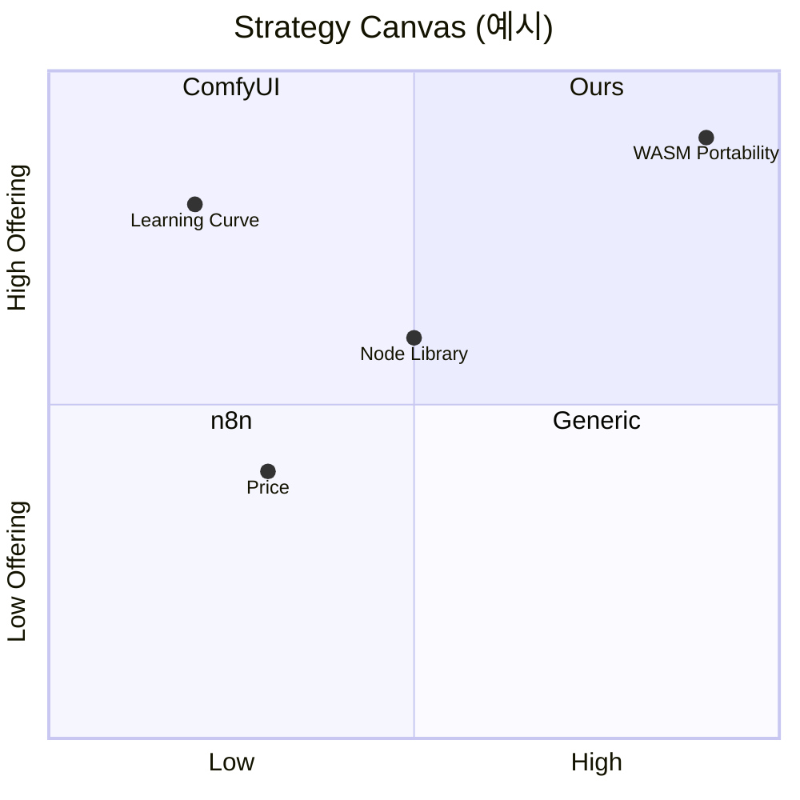

# Gotchas

1. **기능 베끼기 금지 (Feature Parity Trap)** — 레퍼런스 기능을 모두 구현하면 너도 평범해진다. Feature Matrix 는 "따라할 것 / 의도적 제외 / 우리만의 것" 3분할이 목적이지, 체크리스트 복제가 아니다. 출처: [April Dunford — Positioning](https://www.aprildunford.com/).
2. **성공한 레퍼런스만 보기 금지 (Survivorship Bias)** — 실패한/사라진 경쟁자도 teardown 대상. Notion 보면서 Roam 을 놓치지 마라. 실패 원인이 가장 값비싼 인사이트다. 출처: [The Decision Lab — Survivorship Bias](https://thedecisionlab.com/fr-CA/biases/survivorship-bias).
3. **기능만 보고 맥락 무시 금지** — "ComfyUI 노드 연결 UX 똑같이" 가 아니라 "ComfyUI 사용자가 그 UX 를 고용한 이유"를 분해. JTBD 관점으로 재정의. 출처: [Alan Klement — JTBD](https://www.alanklement.com/).
4. **카테고리 경쟁자만 보지 마라** — ComfyUI 의 경쟁자는 Automatic1111 만이 아니다. 사용자가 "이 문제"에 쓰는 모든 대안(엑셀, 종이, 외주)이 경쟁자. Christensen milkshake 원칙. 출처: [Christensen Institute — JTBD](https://www.christenseninstitute.org/theory/jobs-to-be-done/).
5. **차별화를 "없는 기능" 으로 설명 금지** — April Dunford: 포지셔닝은 Competitive alternatives → Unique attributes → Value → Best for 순서. "A 에 없는 B 를 제공" 은 약한 포지셔닝. "X 문제에 최고" 가 강한 포지셔닝.
6. **Lightning Demo 는 3분 타임박스** — 각 레퍼런스당 3분 이상 보면 분석 과잉. 3분 데모 → 훔칠 아이디어 1-2개 스케치 → 다음 제품. 출처: [GV Sprint — Lightning Demos](https://www.gv.com/sprint/).
7. **Feature Matrix 가중치 임의 지정 금지** — 가중치는 사용자 인터뷰/JTBD outcome importance 에서 추출. 기획자 직감으로 점수 주면 확증편향. 출처: [Strategyn ODI — Outcome Importance](https://strategyn.com/lp/outcome-driven-innovation/).
8. **Strategy Canvas 의 "Raise/Reduce/Eliminate/Create" 생략 금지** — Blue Ocean 의 4 Actions 모두 채우지 않으면 red ocean 그대로. 특히 **Eliminate** 가 가장 어렵고 중요하다. 출처: [Blue Ocean Strategy — Four Actions](https://www.blueoceanstrategy.com/tools/four-actions-framework/).
9. **Value Proposition Canvas — 왼쪽(고객) 먼저, 오른쪽(제품) 나중** — Osterwalder 원칙. 제품부터 그리면 이미 정한 기능을 정당화하게 된다. 출처: [Strategyzer — VPC](https://www.strategyzer.com/library/the-value-proposition-canvas).
10. **teardown 에 영상·스크린샷 금지** — 이 스킬은 텍스트 기반 분해. 시각 자료는 첨부하되 원칙은 문장으로 써라. 영상만 첨부하면 나중에 다시 볼 때 맥락이 사라진다.
11. **레퍼런스 5개 이상 필수** — 3개면 편향. 업계 Top 2-3 + 인접 분야 2개 + 실패 사례 1개 를 권장. IDEO "Analogous Inspiration".
12. **teardown 에서 사실과 추론을 분리하라** — "왜 이렇게 설계했는가"는 추론이지 사실이 아니다. 화면 분해만으로는 고객 구매 동기·유지 이유를 알 수 없다. 메모에 `관찰(fact)` 과 `가설(why)` 을 반드시 라벨 구분, 가설은 이후 인터뷰로 검증 대상임을 명시하라. 출처: `docs/planning/reference.md` — Competitive Teardown, [NN/g — Heuristics Summary PDF](https://media.nngroup.com/media/articles/attachments/Heuristic_Summary1_Letter-compressed.pdf).
13. **Feature Matrix 열을 계속 늘리지 마라** — 열이 늘수록 "정말 중요한 차이"가 묻히고, 정성적 품질 차이를 한 칸(✅/⚠️/❌)으로 압축하면 오판한다. Red Route 기반으로 Top 5-8 기능만 남기고, "완성도·발견가능성·제약"을 보조 노트에 풀어 써라 — checkbox 수집기가 되면 parity trap 직행이다. 출처: `docs/planning/reference.md` — Feature Matrix / Comparison Grid.
14. **Strategy Canvas 예쁜 곡선 ≠ 실행 가능성** — "차별화를 위한 차별화(differentiation for differentiation's sake)"는 오히려 가치 파괴다. `Create`보다 `Eliminate/Reduce`를 먼저 검토하고, 곡선 차이 각각에 **왜 그 투자 수준인지** 설명 가능해야 한다. 실행 가능성이 없는 곡선은 감상용 차트일 뿐. 출처: `docs/planning/reference.md` — Blue Ocean Strategy Canvas, [Blue Ocean — Strategy Canvas](https://www.blueoceanstrategy.com/tools/strategy-canvas/).
15. **Heuristic Evaluation 평가자 편차 관리** — NN/g 10 heuristics 는 강력하지만 도메인 특화 UX 문제는 휴리스틱만으론 안 잡히고 평가자 간 편차가 크다. 한 명이 아니라 2-3명이 독립 평가하고 **근거 캡처(스크린샷+인용)** 를 반드시 남겨라, `aesthetic critique` 와 `heuristic violation` 을 구분하라. 출처: `docs/planning/reference.md` — Heuristic Evaluation, [NN/g — Jakob's Ten Usability Heuristics](https://www.nngroup.com/articles/ten-usability-heuristics/).

# Process

## Step 0: 리서치 문서 로드

`docs/planning/reference.md` 로드 (없으면 `/planning-research reference` 권고). 관련 출처: JTBD(discovery.md), 편향(cognitive-biases.md).

## Step 1: 대상 정의

사용자가 "X 같은 Y" 라고 말하면 다음을 순서대로 추출:

1. **Starting Reference**: 명시된 제품 (예: ComfyUI)
2. **Target Domain/Job**: 그 제품이 해결하는 Job (예: "AI 이미지 워크플로우 시각 편집")
3. **Initial Hypothesis**: 왜 이 레퍼런스에 끌렸는가 (감정/맥락)

## Step 2: 레퍼런스 5+ 선정 (Analogous Inspiration)

IDEO "Learn from Analogous Settings" 기법. 다음 4 카테고리로 최소 5개. 출처: [IDEO Design Kit — Analogous Inspiration](https://www.designkit.org/methods/analogous-inspiration.html).

| 카테고리 | 개수 | 예 (ComfyUI 케이스) |
|---------|------|--------------------|
| 직접 경쟁 | 2-3 | ComfyUI · Automatic1111 · Fooocus |
| 인접 도메인 | 1-2 | n8n · Zapier · Rete.js · Figma (노드) |
| 다른 업계 같은 원리 | 1 | Unreal Blueprint · Houdini · Grasshopper |
| 실패/사라진 | 1 | (과거 node editor 프로젝트) |

## Step 3: Lightning Demo (각 3분)

각 제품마다 다음 포맷으로 정리:

```markdown
### Lightning Demo: <Product>
**URL/Source**:
**Big Idea**: (한 줄)
**What to steal**:
- 요소 1 (간단 스케치)
- 요소 2
**What to avoid**:
- 요소 1 (이유)
```

출처: [GV Sprint — Lightning Demos](https://www.gv.com/sprint/).

## Step 4: Competitive Teardown (2-3 제품 심화)

Top 2-3 제품에 대해 Jakob Nielsen 10 heuristics 관점으로 구조 분해:

| 차원 | Product A | Product B |
|------|-----------|-----------|
| Visibility of system status |  |  |
| User control & freedom |  |  |
| Consistency & standards |  |  |
| Error prevention |  |  |
| Recognition vs recall |  |  |
| Flexibility & efficiency |  |  |
| Aesthetic & minimalist |  |  |
| Error recovery |  |  |
| Help & documentation |  |  |

출처: [NN/g — 10 Usability Heuristics](https://www.nngroup.com/articles/ten-usability-heuristics/).

## Step 5: Feature Matrix

제품 × 기능 2D 표. 가중치는 사용자 outcome importance 에서 도출 (자의적 점수 금지):

```markdown
| Feature | Weight (1-5) | ComfyUI | A1111 | n8n | Blueprint | Ours? |
|---------|-------------|---------|-------|-----|-----------|-------|
| Node drag/drop | 5 | ✅ | ❌ | ✅ | ✅ | MUST |
| Subgraph composition | 4 | ⚠️ | ❌ | ✅ | ✅ | MUST |
| Realtime preview | 3 | ✅ | ⚠️ | ❌ | ✅ | LIKE |
| WASM 런타임 | 5 | ❌ | ❌ | ❌ | ❌ | **ONLY US** |
| ...  | | | | | | |
```

Ours 컬럼: **MUST** (따라할 것) / **LIKE** (Nice to have) / **NO** (의도적 제외) / **ONLY US** (차별화).

출처: [April Dunford — Positioning Introduction](https://www.aprildunford.com/post/an-introduction-to-positioning), `docs/planning/reference.md` — Feature Matrix.

## Step 6: Value Proposition Canvas (Osterwalder)

### 왼쪽 — Customer (먼저)
- **Jobs**: functional / emotional / social (JTBD 형식)
- **Pains**: 현재 레퍼런스로 해결되지 않는 고통
- **Gains**: 기대하는 긍정적 결과

### 오른쪽 — Product (나중)
- **Products & Services**: 우리 제품의 핵심 기능
- **Pain Relievers**: 고통을 어떻게 덜어주는가
- **Gain Creators**: 기대 결과를 어떻게 만드는가

출처: [Strategyzer — Value Proposition Canvas](https://www.strategyzer.com/library/the-value-proposition-canvas).

## Step 7: Blue Ocean — Strategy Canvas + Four Actions

### Strategy Canvas (각 차원 0-10 score)



### Four Actions
- **Eliminate**: 업계 당연하지만 제거할 것 (예: 서버 세팅)
- **Reduce**: 줄일 것 (예: 노드 종류 수 → 핵심 20개만)
- **Raise**: 더 키울 것 (예: 브라우저 즉시 실행)
- **Create**: 새로 만들 것 (예: 공유 가능한 .wasm 번들)

출처: [Blue Ocean Strategy — Four Actions](https://www.blueoceanstrategy.com/tools/four-actions-framework/).

## Step 8: Positioning Statement (April Dunford)

```text
For <target customer>
who <has this need / is dissatisfied with current alternatives>,
<our product> is a <product category>
that <key benefit / reason to believe>.
Unlike <competitive alternatives>,
we <primary differentiation>.
```

1문장 버전도 만들어라 ("~~을 위한 X" 식).

출처: [April Dunford — Obviously Awesome](https://www.aprildunford.com/books).

## Step 9: 저장

`.planning/reference-<slug>.md` 저장:

```markdown
# Reference Analysis: <Domain>

## Starting Reference & Hypothesis
## Analogous Set (5+)
## Lightning Demos
## Teardown (Heuristics)
## Feature Matrix
## Value Proposition Canvas
## Strategy Canvas + Four Actions
## Positioning Statement
## Differentiation Decisions (MUST / LIKE / NO / ONLY US)
## Open Questions (다음 discovery 로 이월)
```

## Step 10: 다음 단계

- Top 차별화 포인트 → `/plan-ideate` (그 포인트를 HMW 로 변환하여 발산)
- 핵심 Job/User 명확해짐 → `/plan-discover` 로 인계
- MVP 스코프 결정 → `/plan-prioritize`
- 기술 feasibility 의심 → 해당 kit 의 `-guide`/`-audit` (planning-kit 은 스택 결정 안 함)

# References

- `docs/planning/reference.md` — SSOT (Lightning Demo · Teardown · VPC · Blue Ocean · Positioning · Feature Matrix)
- `docs/planning/discovery.md` — JTBD 재정의
- `docs/planning/cognitive-biases.md` — Survivorship / Confirmation

주요 1차 출처 (리서치 md 검증된 URL):
- [GV Sprint — Lightning Demos](https://www.gv.com/sprint/)
- [The Sprint Book](https://www.thesprintbook.com/)
- [IDEO Design Kit — Analogous Inspiration](https://www.designkit.org/methods/analogous-inspiration.html)
- [Strategyzer — Value Proposition Canvas Library](https://www.strategyzer.com/library/the-value-proposition-canvas)
- [Strategyzer — VPC Instruction Manual](https://www.strategyzer.com/resources/canvas-tools-guides/the-value-proposition-canvas-instruction-manual)
- [Blue Ocean Strategy — Strategy Canvas](https://www.blueoceanstrategy.com/tools/strategy-canvas/)
- [Blue Ocean Strategy — Four Actions Framework](https://www.blueoceanstrategy.com/tools/four-actions-framework/)
- [April Dunford — An Introduction to Positioning](https://www.aprildunford.com/post/an-introduction-to-positioning)
- [Alan Klement — JTBD Articles Hub](https://www.alanklement.com/)
- [HBR — Know Your Customers' Jobs to Be Done](https://hbr.org/2016/09/know-your-customers-jobs-to-be-done)
- [Michael Porter — Five Competitive Forces (HBR 2008)](https://hbr.org/2008/01/the-five-competitive-forces-that-shape-strategy)
- [NN/g — Jakob's Ten Usability Heuristics](https://www.nngroup.com/articles/ten-usability-heuristics/)
- [NN/g — Heuristics Summary PDF](https://media.nngroup.com/media/articles/attachments/Heuristic_Summary1_Letter-compressed.pdf)
- [Jim Collins — Turning the Flywheel](https://www.jimcollins.com/books/turningtheflywheel.html)
- [Kano Model Citation Record](https://www.scirp.org/reference/referencespapers?referenceid=1217282)
- [Growth.Design — Case Studies](https://growth.design/case-studies/)
