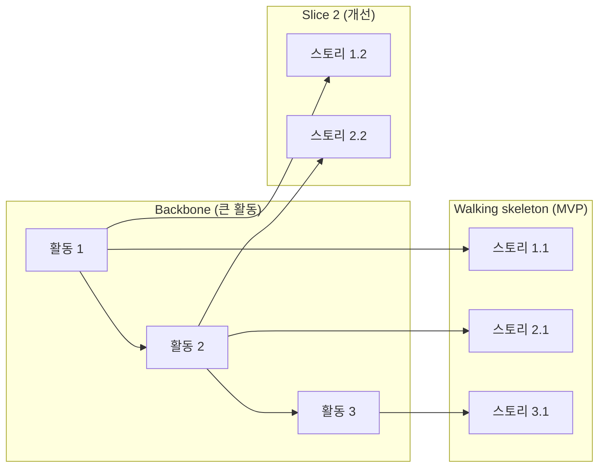

# Gotchas

1. **스토리 포맷만 지키고 내용 무시 금지** — "As a user, I want X, so that Y" 는 껍데기다. Who/What/Why 가 구체적이지 않으면 가치 없다.
2. **INVEST 없이 승인 금지** — 모든 스토리는 Independent/Negotiable/Valuable/Estimable/Small/Testable 6개 중 하나라도 실패하면 재작성.
3. **기술 작업을 스토리로 포장 금지** — "As a developer, I want to refactor DB" 는 스토리가 아니라 기술 태스크다. 별도 섹션으로 분리.
4. **Acceptance Criteria 빈약 금지** — AC 는 최소 happy path + 최소 2개 edge case. "로그인에 성공한다" 같은 단일 AC 는 불충분.
5. **Given-When-Then 3개 섹션 모두 채우기** — Given 생략하면 전제 상태가 모호해진다. When 여러 개 섞지 마라 (트리거 1개씩 분리).
6. **Story Mapping vs 평면 백로그** — 기능이 3개 이상 스토리로 쪼개지면 Jeff Patton Story Map 형태(backbone → walking skeleton → slices) 권고.
7. **Estimable 판단** — 한 스프린트(1-2주) 내 완료 불가능하면 Epic 으로 승격 후 재분해.
8. **INVEST 는 우선순위 도구가 아니다** — 품질 체크이므로 형식만 맞아도 맥락 없는 스토리일 수 있다. Negotiable 항목이 "구현 방법이 열려 있는가" 로 실제 검증되어야 한다. 출처: [Agile Alliance — INVEST](https://agilealliance.org/glossary/invest/).
9. **Gherkin 을 UI step 으로 채우지 마라** — Given-When-Then 은 관찰 가능한 행동 규칙을 서술해야 하며, 버튼 위치/DB 상태 같은 구현 세부는 brittle test 를 만든다. 각 시나리오는 3~5 step 이내로 유지. 출처: [Cucumber Gherkin Reference](https://cucumber.io/docs/gherkin/reference).
10. **Story Map 이 워크숍 산출물로만 끝나면 가치 소실** — backbone + walking skeleton 이후 실제 backlog/roadmap 과 링크되지 않으면 유지비가 커진다. release slice 가 "작지만 완결된 경험" 이어야 함. 출처: [Jeff Patton — Story Mapping](https://jpattonassociates.com/story-mapping/).
11. **Acceptance Criteria 가 설계 문서가 되면 협상 불가** — criteria 는 완료 판단이지 구현 명세가 아니다. 구현 힌트는 주되 강제하지 않도록, happy path + edge case (빈/에러/권한/네트워크) 를 분리 기술. 출처: [Cucumber Gherkin](https://cucumber.io/docs/gherkin/).

# Process

## Step 0: 리서치 문서 로드

`docs/planning/stories.md` (INVEST, Gherkin, Story Mapping) 로드.

## Step 1: 입력 파싱

- PRD 경로가 있으면 로드
- Problem / User / Solution 식별
- 기능 경계 단위로 1차 분할

## Step 2: 초안 스토리 생성

포맷:
```text
US-###: <제목>
As a <persona>,
I want to <goal>,
so that <benefit>.
```

persona 는 discovery/PRD 의 구체 persona 이름 사용. "user" 금지.

## Step 3: Acceptance Criteria (Gherkin)

각 스토리당 AC 3개 이상:

```gherkin
Scenario: <시나리오 이름>
Given <전제 상태>
When <트리거 액션>
Then <기대 결과>
And <추가 기대>
```

필수 포함:
- Happy path 1개
- Edge case 2개 이상 (빈 상태, 에러, 동시성, 권한 없음, 네트워크 단절 등)

## Step 4: INVEST 체크

각 스토리 6개 항목 점검 — 출처: [Agile Alliance INVEST](https://agilealliance.org/glossary/invest/):

| 항목 | 질문 | 실패 시 조치 |
|------|------|-------------|
| I | 다른 스토리에 의존하지 않고 배포 가능한가 | 의존 스토리를 선행으로 분리 |
| N | 구현 방법은 협상 가능한가 | 기술 구현 디테일 제거 |
| V | 사용자/비즈니스 가치가 명확한가 | so that 절 재작성 |
| E | 엔지니어가 규모 추정 가능한가 | 모호한 부분 질문 |
| S | 1 스프린트 내 완료 가능한가 | Epic 으로 승격 후 재분해 |
| T | AC 로 완료를 검증 가능한가 | AC 보강 |

## Step 5: Story Map (스토리 3개 이상 시)

출처: [Jeff Patton — Story Mapping](https://jpattonassociates.com/story-mapping/), [User Story Mapping Presentation](https://jpattonassociates.com/user-story-mapping-presentation/).



Jeff Patton — Backbone 을 가로로, 우선순위(slice) 를 세로로.

## Step 6: 저장

`.planning/stories-<slug>.md` 에 저장:

```markdown
# Stories: <기능>

## Epic
<상위 목표>

## Stories
### US-001: ...
### US-002: ...

## Story Map (Mermaid)

## Technical Tasks (스토리 아님)
- T-001: ...
```

## Step 7: 다음 단계

- 우선순위 스코어링 → `/plan-prioritize`
- GitHub Issues 로 분해 → `/plan-sync-github`
- 리스크 점검 → `/plan-risks`

# References

- `docs/planning/stories.md` — INVEST, Gherkin, Story Mapping, Acceptance Criteria

주요 1차 출처:
- [Agile Alliance — INVEST](https://agilealliance.org/glossary/invest/)
- [Cucumber Gherkin Reference](https://cucumber.io/docs/gherkin/reference)
- [Cucumber Docs](https://cucumber.io/docs)
- [Jeff Patton — Story Mapping](https://jpattonassociates.com/story-mapping/)
- [Story Mapping Boot Camp](https://jpattonassociates.com/story-mapping-boot-camp/)
