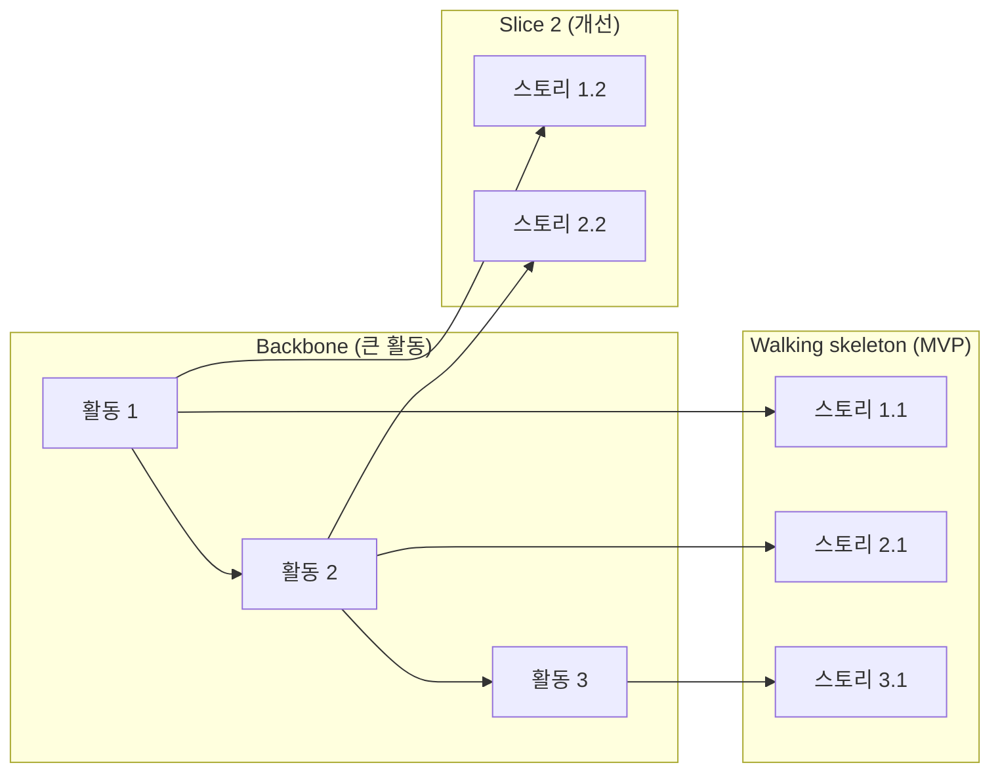

# Gotchas

1. **스토리 포맷만 지키고 내용 무시 금지** — "As a user, I want X, so that Y" 는 껍데기다. Who/What/Why 가 구체적이지 않으면 가치 없다.
2. **INVEST 없이 승인 금지** — 모든 스토리는 Independent/Negotiable/Valuable/Estimable/Small/Testable 6개 중 하나라도 실패하면 재작성.
3. **기술 작업을 스토리로 포장 금지** — "As a developer, I want to refactor DB" 는 스토리가 아니라 기술 태스크다. 별도 섹션으로 분리.
4. **Acceptance Criteria 빈약 금지** — AC 는 최소 happy path + 최소 2개 edge case. "로그인에 성공한다" 같은 단일 AC 는 불충분.
5. **Given-When-Then 3개 섹션 모두 채우기** — Given 생략하면 전제 상태가 모호해진다. When 여러 개 섞지 마라 (트리거 1개씩 분리).
6. **Story Mapping vs 평면 백로그** — 기능이 3개 이상 스토리로 쪼개지면 Jeff Patton Story Map 형태(backbone → walking skeleton → slices) 권고.
7. **Estimable 판단** — 한 스프린트(1-2주) 내 완료 불가능하면 Epic 으로 승격 후 재분해.
8. **INVEST 는 우선순위 도구가 아니다** — 품질 체크이므로 형식만 맞아도 맥락 없는 스토리일 수 있다. Negotiable 항목이 "구현 방법이 열려 있는가" 로 실제 검증되어야 한다. 출처: [Agile Alliance — INVEST](https://agilealliance.org/glossary/invest/).
9. **Gherkin 을 UI step 으로 채우지 마라** — Given-When-Then 은 관찰 가능한 행동 규칙을 서술해야 하며, 버튼 위치/DB 상태 같은 구현 세부는 brittle test 를 만든다. 각 시나리오는 3~5 step 이내로 유지. 출처: [Cucumber Gherkin Reference](https://cucumber.io/docs/gherkin/reference).
10. **Story Map 이 워크숍 산출물로만 끝나면 가치 소실** — backbone + walking skeleton 이후 실제 backlog/roadmap 과 링크되지 않으면 유지비가 커진다. release slice 가 "작지만 완결된 경험" 이어야 함. 출처: [Jeff Patton — Story Mapping](https://jpattonassociates.com/story-mapping/).
11. **Acceptance Criteria 가 설계 문서가 되면 협상 불가** — criteria 는 완료 판단이지 구현 명세가 아니다. 구현 힌트는 주되 강제하지 않도록, happy path + edge case (빈/에러/권한/네트워크) 를 분리 기술. 출처: [Cucumber Gherkin](https://cucumber.io/docs/gherkin/).
12. **요청한 스토리 범위만 — 임의 스토리·AC 확장 금지 (skill-design-guide §5.5 Scope-Bound)** — 사용자가 특정 기능/에픽의 스토리만 요청하면 그 범위만 분해한다. "백로그를 채운다"는 이유로 요청하지 않은 인접 기능·후속 스토리·운영(감사/권한/알림) 스토리를 임의로 추가하지 마라. INVEST 의 Negotiable 은 "스토리는 고정 계약이 아니라 대화의 시작점" — 범위는 사용자와 협상하지 미리 확정해 부풀리지 않는다. Story Map 으로 인접 슬라이스가 보이면 그 사실을 **먼저 알리고** 추가 여부를 확인한다 (insights-report #1 excessive_changes 대응). 출처: [Agile Alliance — INVEST (Negotiable/Small)](https://agilealliance.org/glossary/invest/).
13. **계약 경계를 넘는 스토리는 양면(two-sided) 으로 열거한다 (skill-design-guide §5.5 Counterpart Enumeration)** — 스토리가 API 응답 형태, 직렬화 포맷(날짜·타임존·enum·null), 공유 모델, 이벤트 페이로드, DB 스키마 중 하나라도 건드리면 **producer 면과 consumer 면을 둘 다** Step 6 산출물의 `## Surfaces` 섹션에 적는다. 한쪽만 적힌 스토리는 Independent 처럼 보이지만 실제로는 반쪽이며, 구현 스프린트에서 "서버만 바꾸고 클라 누락" 으로 재현된다 (insights-report Friction #4). Gherkin 의 `Then` 은 "system 밖으로 나오는 관찰 가능한 출력" 을 대상으로 하므로, 그 출력을 **누가 관측하는지**를 이름으로 적지 않으면 AC 자체가 검증면을 특정하지 못한다. 양면을 한 스토리에 담기 부담스러우면 소비면을 **별도 스토리로 분리**하되, 스토리를 실제로 추가하기 전에 Gotcha 12 에 따라 사용자에게 먼저 알리고 확인받는다 (열거는 의무, 스토리 추가는 합의 사항). 열거 자체를 조용히 빠뜨리지 마라. 소비자가 존재할 수 없는 순수 내부 변경이면 "소비면 없음" 을 근거와 함께 적는다 (추측으로 생략 금지). 출처: [Cucumber Gherkin Reference](https://cucumber.io/docs/gherkin/reference), skill-design-guide §5.5.

# Process

## Step 0: 자동 로드 (독립 단계)

**이 단계에서 스토리를 작성하지 않는다.** 작성에 필요한 배경만 로드한다:

1. **원칙 문서**: `docs/planning/stories.md` (INVEST, Gherkin, Story Mapping). 없으면 `/planning-research stories` 권고 후 중단.
2. **이전 단계 산출물**: `.planning/prd-*.md` 가 있으면 로드 (최신 우선). 없으면 `/plan-prd` 먼저 권고.
3. **선택 참조**: `.planning/discover-*.md` (persona 추출용), `.planning/data-model-*.md` (엔티티 이름 매핑용).

원칙 문서나 PRD 둘 중 하나라도 없으면 Step 1 진입 금지 — 추측 기반 스토리는 Estimable 판정 불가.

## Step 1: 입력 파싱

- Step 0 에서 로드된 PRD 에서 Problem / User / Solution 식별
- 기능 경계 단위로 1차 분할
- 추가로 사용자가 명시한 기능 설명이 있으면 병합

## Step 2: 초안 스토리 생성

포맷:
```text
US-###: <제목>
As a <persona>,
I want to <goal>,
so that <benefit>.
```

persona 는 discovery/PRD 의 구체 persona 이름 사용. "user" 금지.

## Step 3: Acceptance Criteria (Gherkin)

각 스토리당 AC 3개 이상:

```gherkin
Scenario: <시나리오 이름>
Given <전제 상태>
When <트리거 액션>
Then <기대 결과>
And <추가 기대>
```

필수 포함:
- Happy path 1개
- Edge case 2개 이상 (빈 상태, 에러, 동시성, 권한 없음, 네트워크 단절 등)

## Step 4: INVEST 체크

각 스토리 6개 항목 점검 — 출처: [Agile Alliance INVEST](https://agilealliance.org/glossary/invest/):

| 항목 | 질문 | 실패 시 조치 |
|------|------|-------------|
| I | 다른 스토리에 의존하지 않고 배포 가능한가 | 의존 스토리를 선행으로 분리 |
| N | 구현 방법은 협상 가능한가 | 기술 구현 디테일 제거 |
| V | 사용자/비즈니스 가치가 명확한가 | so that 절 재작성 |
| E | 엔지니어가 규모 추정 가능한가 | 모호한 부분 질문 |
| S | 1 스프린트 내 완료 가능한가 | Epic 으로 승격 후 재분해 |
| T | AC 로 완료를 검증 가능한가 — **그리고 "이 AC 가 충족되지 않았음" 을 보여줄 관측을 한 줄로 쓸 수 있는가** | 반증 관측을 못 쓰면 AC 보강 |

**Testable 은 반증가능성(falsifiability) 기준이다.** INVEST 의 T 는 "Testable — in principle, even if there isn't a test for it yet" 이다. 즉 지금 테스트가 없어도 되지만 **원리적으로 실패를 관측할 수 있어야** 한다. 판정 절차: 각 AC 의 `Then` 을 읽고 "무엇을 보면 이게 틀렸다고 말할 수 있나" 에 답한다. 답이 "코드를 봐야 안다" / "느낌상 개선됐는지" 라면 반증 불가능한 AC 이므로 관찰 가능한 출력으로 다시 쓴다 — Gherkin 의 `Then` 은 actual 결과와 expected 결과를 비교하는 단계이고, 그 대상은 "system 밖으로 나오는 것(리포트·UI·메시지)" 이어야 한다. 출처: [Agile Alliance — INVEST](https://agilealliance.org/glossary/invest/), [Cucumber Gherkin Reference](https://cucumber.io/docs/gherkin/reference).

## Step 5: Story Map (스토리 3개 이상 시)

출처: [Jeff Patton — Story Mapping](https://jpattonassociates.com/story-mapping/), [User Story Mapping Presentation](https://jpattonassociates.com/user-story-mapping-presentation/).



Jeff Patton — Backbone 을 가로로, 우선순위(slice) 를 세로로.

## Step 6: 저장

`.planning/stories-<slug>.md` 에 저장:

```markdown
# Stories: <기능>

## Epic
<상위 목표>

## Stories
### US-001: ...
### US-002: ...

## Story Map (Mermaid)

## Surfaces (양면 열거 — Gotcha 13)
계약 경계를 넘는 스토리만 기재. 순수 내부 변경이면 "소비면 없음 + 근거" 한 줄.

| 스토리 | producer 면 | consumer 면 | 같은 스프린트 처리 |
|--------|-------------|-------------|-------------------|
| US-001 | (예: 주문 조회 API 응답) | (예: 주문 목록 화면) | 예 / 아니오 → 분리 스토리 US-00N |

## Technical Tasks (스토리 아님)
- T-001: ...
```

`## Surfaces` 는 문장 다짐이 아니라 **파일에 남는 열거 아티팩트**다 (skill-design-guide §3.7 등급 기준 E2). 표가 비어 있고 근거 한 줄도 없으면 열거를 안 한 것이므로 저장 전에 채운다.

## Step 7: 다음 단계

- 우선순위 스코어링 → `/plan-prioritize`
- GitHub Issues 로 분해 → `/plan-sync-github`
- 리스크 점검 → `/plan-risks`

# References

- `docs/planning/stories.md` — INVEST, Gherkin, Story Mapping, Acceptance Criteria

주요 1차 출처:
- [Agile Alliance — INVEST](https://agilealliance.org/glossary/invest/)
- [Cucumber Gherkin Reference](https://cucumber.io/docs/gherkin/reference)
- [Cucumber Docs](https://cucumber.io/docs)
- [Jeff Patton — Story Mapping](https://jpattonassociates.com/story-mapping/)
- [Story Mapping Boot Camp](https://jpattonassociates.com/story-mapping-boot-camp/)
